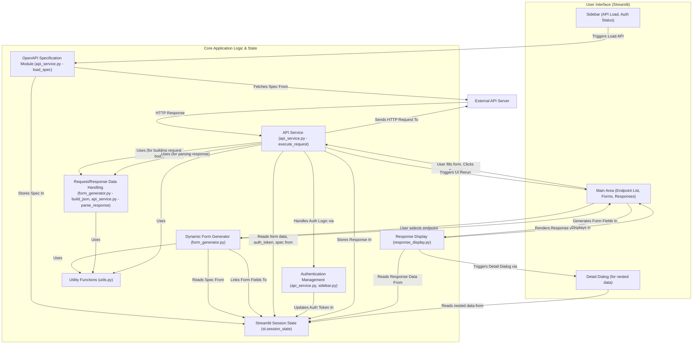

[](https://www.python.org/)
[](https://streamlit.io/)

# OpenAPI Custom Interface

This project is an **interactive client** for APIs described by the *OpenAPI Specification*. It allows users to load an API definition, which is then used to **dynamically generate input forms** for each endpoint. Users can fill in parameters and request bodies, execute API calls via an **API Service**, and view the results, which are **displayed** in a user-friendly format, including tabular views and detailed pop-ups. The application manages user input, API responses, and **authentication tokens** persistently across interactions using the **Streamlit Session State**.

## Features

*   **Dynamic UI for API Interaction:** Leverages Streamlit to create an interactive user experience.
*   **OpenAPI Specification Driven:** Fetches and parses OpenAPI (v3) specifications to understand API structure, endpoints, parameters, and schemas.
*   **Dynamic Form Generation:** Automatically creates input forms for API parameters and request bodies based on their OpenAPI schema definitions (types, enums, nested objects, arrays).
*   **Authentication Management:** Supports Bearer token authentication by allowing users to log in via a designated API endpoint, storing the received token in session state, and automatically including it in subsequent requests.
*   **Robust State Management:** Utilizes Streamlit's `session_state` to persistently manage API specifications, authentication tokens, form input values, UI state (active tabs/expanders), and API responses across user interactions.
*   **Comprehensive API Service:** Handles the construction and execution of HTTP requests (GET, POST, PUT, DELETE, etc.) to external APIs, including parameter building, header management (with automatic auth token injection), and request body serialization.
*   **Structured Data Handling:** Manages the serialization of form data into JSON/form-urlencoded request bodies and deserialization of API responses (primarily JSON) into Python objects. Includes utility functions for navigating nested data structures.
*   **User-Friendly Response Display:** Presents API responses clearly, showing status codes, raw JSON, and attempting to render lists of objects in a tabular format with interactive "View Details" buttons for nested data, displayed in a modal-like detail view.

## Technical Stack

*   **Backend & Core Logic:** Python
*   **Web Framework/UI:** Streamlit
*   **API Interaction:** Python `requests` library
*   **Data Handling:** JSON (for API specifications, request/response bodies)
*   **Diagramming (in documentation):** Mermaid.js
*   **(Optional) Data Display:** Pandas (for enhanced tabular views if installed)

## Project Architecture Overview

The application's architecture revolves around several key components that interact to provide a seamless API testing experience:

1.  **OpenAPI Specification (Chapter 1):** The blueprint. The application fetches and parses an API's OpenAPI document to understand its structure, endpoints, and data requirements. This is stored in session state.
2.  **Dynamic Form Generation (Chapter 2):** Using the parsed OpenAPI spec, this component automatically creates Streamlit input widgets (text inputs, number inputs, select boxes, etc.) for each endpoint's parameters and request body. User input is linked to session state via unique keys.
3.  **Authentication Management (Chapter 3):** Handles API login by allowing users to execute a designated authentication endpoint. The received `access_token` is stored in session state and automatically added as a `Bearer` token to subsequent requests.
4.  **Streamlit Session State (Chapter 4):** The core "memory" of the application. It's a dictionary-like object (`st.session_state`) that persists data (loaded spec, auth token, form values, UI state, API responses) across script reruns for a single user session.
5.  **API Service (Chapter 5):** The worker module responsible for constructing and sending HTTP requests to the external API (using the `requests` library) and processing the responses. It uses data from session state (form inputs, auth token) to build requests.
6.  **Request & Response Data Handling (Chapter 6):** Focuses on serializing form data into the correct request body format (e.g., JSON) and deserializing API responses (e.g., JSON) into Python objects. Utilities help navigate nested data.
7.  **API Response Display (Chapter 7):** Takes the processed API response data from session state and renders it in the UI, including status codes, raw JSON, and a structured tabular view for lists of objects, with "drill-down" capabilities for nested details.

### Visual Overview



## Getting Started

Follow these instructions to set up and run the project locally.

### Prerequisites

*   Python 3.8 or higher
*   pip (Python package installer)

### Installation

1.  **Clone the repository:**
    ```bash
    git clone https://github.com/hugopessolano/openapi-custom-interface.git
    cd openapi-custom-interface
    ```

2.  **Create and activate a virtual environment:**

    *   **On Windows:**
        ```bash
        python -m venv venv
        .\venv\Scripts\activate
        ```
    *   **On macOS/Linux:**
        ```bash
        python3 -m venv venv
        source venv/bin/activate
        ```

3.  **Install the dependencies:**
    ```bash
    pip install -r requirements.txt
    ```
    *(Ensure you have a `requirements.txt` file in your project root containing `streamlit`, `requests`, and optionally `pandas`.)*

### Running the Application

Once the dependencies are installed, you can run the Streamlit application using:

```bash
streamlit run app.py
```
*(Replace `app.py` with the actual name of your main Streamlit application file if it's different.)*

The application will then be accessible in your web browser, typically at `http://localhost:8501`.

## Core Concepts & Architectural Highlights

This project demonstrates proficiency in several key software engineering areas:

*   **OpenAPI-Driven Development:** The entire application adapts its UI and behavior based on the provided OpenAPI specification, showcasing the ability to work with and interpret API contracts.
*   **Dynamic UI Generation:** Instead of hardcoding forms, the application intelligently creates input fields based on API schemas, demonstrating a flexible and scalable approach to UI design.
*   **Stateful Web Applications with Streamlit:** Effectively uses `st.session_state` to manage application state (API spec, auth tokens, user inputs, UI selections) across interactions in Streamlit's stateless rerun model.
*   **Modular Design:** The codebase is organized into distinct modules with clear responsibilities (e.g., `api_service.py` for API calls, `form_generator.py` for UI, `state_manager.py` for state initialization).
*   **Robust API Interaction:** Handles various aspects of API communication, including different HTTP methods, parameter types (path, query, header, body), authentication (Bearer token), and response processing.
*   **Data Transformation:** Implements logic for serializing Python data structures into JSON for request bodies and deserializing JSON responses back into Python objects, including handling nested structures.
*   **User-Centric Design:** Focuses on providing a clear and interactive way to explore and test APIs, with features like organized endpoint displays, immediate response feedback, and detailed views for complex data.

## For Recruiters

This project showcases:

*   **Python Development:** Core application logic, API client implementation, data manipulation.
*   **Streamlit Web Development:** Building interactive and stateful web UIs quickly.
*   **API Design & Integration:** Deep understanding of OpenAPI specifications, RESTful principles, authentication mechanisms, and HTTP protocols.
*   **Software Architecture:** Designing a modular application with clear separation of concerns and effective state management.
*   **Problem Solving:** Creating a sophisticated tool that simplifies a common developer task (API exploration and testing).
*   **Data Structures & Algorithms:** Handling and navigating potentially complex, nested JSON data from API schemas and responses.

This application is a practical demonstration of building a developer tool that addresses real-world needs in API interaction and testing.

## Future Enhancements (Potential)

*   Support for more OpenAPI features (e.g., more complex authentication schemes like OAuth2, `oneOf`/`anyOf` schemas).
*   Saving and loading API configurations/sessions.
*   Generating code snippets for API calls in different languages.
*   More advanced response visualization options.
*   Support for importing/exporting API collections (e.g., Postman format).

