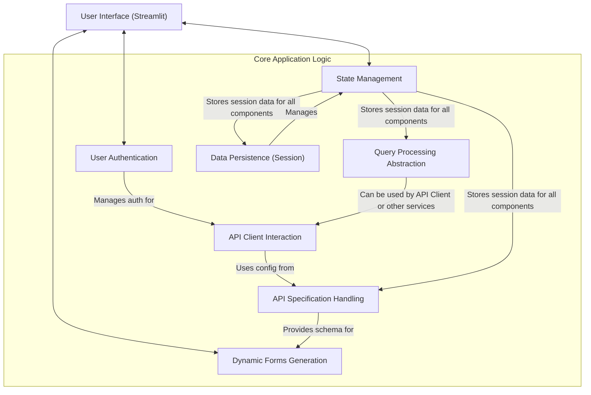

# OpenAPI Custom Interface

[](https://www.python.org/)
[](https://streamlit.io/)

A dynamic and user-friendly web application built with Python and Streamlit, designed to streamline interaction with diverse APIs. This project provides an intuitive interface for managing API specifications (like OpenAPI/Swagger), configuring endpoints, handling authentication, and executing API calls, all through a custom-generated UI.

It's an ideal tool for developers, testers, or anyone needing to quickly understand, test, and interact with various API services without writing extensive boilerplate code.

## Features

*   **Dynamic UI for API Interaction:** Leverages Streamlit to create an interactive user experience.
*   **API Specification Handling:** Ingests and parses API specification files (e.g., `openapi.json`) to understand endpoints, methods, parameters, and response formats.
*   **User Authentication:** Securely manages user sessions and authentication for accessing protected API functionalities.
*   **Query Processing Abstraction:** Implements a flexible layer for crafting and executing SQL-like queries, potentially adaptable to various data sources.
*   **Robust State Management:** Utilizes Streamlit's `session_state` for managing application and user session data effectively, preventing common errors like `KeyError`.
*   **Dynamic Form Generation:** Automatically generates input forms based on JSON schemas derived from API specifications, simplifying data entry for API requests.
*   **Data Persistence (Session-based):** Manages data within user sessions for a coherent experience (e.g., saving form inputs, API responses).
*   **Modular API Client Interaction:** Provides a structured way to make HTTP requests to external APIs.

## Technical Stack

*   **Backend & Core Logic:** Python
*   **Web Framework/UI:** Streamlit
*   **API Interaction:** Python `requests` library
*   **Data Handling:** JSON (for API specifications and schemas)

## Project Architecture Overview

The application is structured modularly, with clear separation of concerns:


*(This diagram illustrates the high-level interaction between the core components described in the documentation.)*

## Getting Started

Follow these instructions to set up and run the project locally.

### Prerequisites

*   Python 3.8 or higher
*   pip (Python package installer)

### Installation

1.  **Clone the repository:**
    ```bash
    git clone https://github.com/hugopessolano/openapi-custom-interface.git
    cd openapi-custom-interface
    ```

2.  **Create and activate a virtual environment:**

    *   **On Windows:**
        ```bash
        python -m venv venv
        .\venv\Scripts\activate
        ```
    *   **On macOS/Linux:**
        ```bash
        python3 -m venv venv
        source venv/bin/activate
        ```

3.  **Install the dependencies:**
    ```bash
    pip install -r requirements.txt
    ```
    *(Ensure you have a `requirements.txt` file in your project root containing all necessary packages like `streamlit`, `requests`, etc.)*

### Running the Application

Once the dependencies are installed, you can run the Streamlit application using:

```bash
streamlit run app.py
```
*(Replace `app.py` with the actual name of your main Streamlit application file if it's different.)*

The application will then be accessible in your web browser, typically at `http://localhost:8501`.

## Core Concepts & Architectural Highlights

This project demonstrates several key software engineering concepts:

*   **API Specification Handling (Chapter 3):**
    The application can load and parse API specification files (e.g., `openapi.json`). This allows it to dynamically understand the API's structure, including endpoints, request methods, parameters, and response formats, forming the basis for automated UI generation and interaction.

*   **Query Processing Abstraction (Chapter 4):**
    A sophisticated abstraction layer designed to simplify crafting and executing SQL-like queries across potentially diverse data sources (e.g., SQL databases like PostgreSQL, NoSQL databases like MongoDB). This module aims to provide a uniform interface, decoupling the application logic from specific database query languages.

*   **State Management (Chapter 5 & 6 - Data Persistence):**
    Leverages Streamlit's `st.session_state` for robust management of session-specific data. This includes initializing state with default values to prevent errors and persisting data across user interactions within a session, ensuring a smooth and consistent user experience.

*   **API Client Interaction (Chapter 7):**
    A dedicated module for handling interactions with external APIs. It encapsulates the logic for making HTTP requests (GET, POST, etc.), managing request parameters, and processing responses, including error handling.

*   **Dynamic Forms Generation (Chapter 8):**
    One of the standout features is the ability to generate HTML forms dynamically based on JSON schemas. This means the UI can adapt to different API endpoint requirements without manual coding of forms, making the application highly flexible and scalable for various API integrations.

*   **User Authentication (Chapter 2) & UI Components (Chapter 1):**
    Provides a secure login/logout mechanism and utilizes various Streamlit UI components (sidebars, forms, dialogs) to create an intuitive and organized user interface for API configuration and interaction.

## For Recruiters

This project showcases proficiency in:

*   **Python Development:** Core logic, API interaction, data processing.
*   **Web Application Development:** Using Streamlit for rapid UI development.
*   **API Integration:** Deep understanding of API specifications (OpenAPI), request/response cycles, and authentication.
*   **Software Design & Architecture:** Modular design, abstraction principles (e.g., Query Processor), and state management.
*   **Problem Solving:** Creating a tool that simplifies a complex task (interacting with multiple APIs).
*   **Data Handling:** Parsing and utilizing JSON for schemas and API data.

It demonstrates the ability to build a practical, user-centric application that addresses real-world development needs.

## Future Enhancements (Potential)

*   Support for more API specification formats.
*   Enhanced query builder UI for the Query Processing module.
*   Persistent storage of API configurations beyond session scope.
*   OAuth 2.0 support for API authentication.
*   Automated generation of API documentation snippets.
