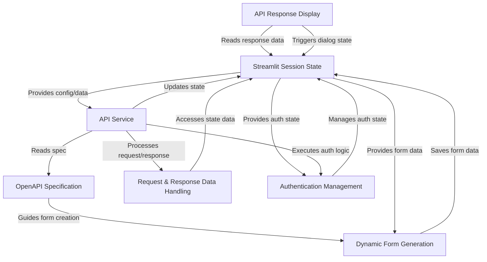

# Tutorial: openapi-custom-interface

This project is an **interactive client** for APIs described by the
*OpenAPI Specification*. It allows users to load an API definition,
which is then used to **dynamically generate input forms** for
each endpoint. Users can fill in parameters and request bodies,
execute API calls via an **API Service**, and view the results,
which are **displayed** in a user-friendly format, including tabular
views and detailed pop-ups. The application manages user input,
API responses, and **authentication tokens** persistently across
interactions using the **Streamlit Session State**.

## Visual Overview

## Chapters

1. [OpenAPI Specification
](01_openapi_specification_.md)
2. [Dynamic Form Generation
](02_dynamic_form_generation_.md)
3. [Authentication Management
](03_authentication_management_.md)
4. [Streamlit Session State
](04_streamlit_session_state_.md)
5. [API Service
](05_api_service_.md)
6. [Request & Response Data Handling
](06_request___response_data_handling_.md)
7. [API Response Display
](07_api_response_display_.md)

---