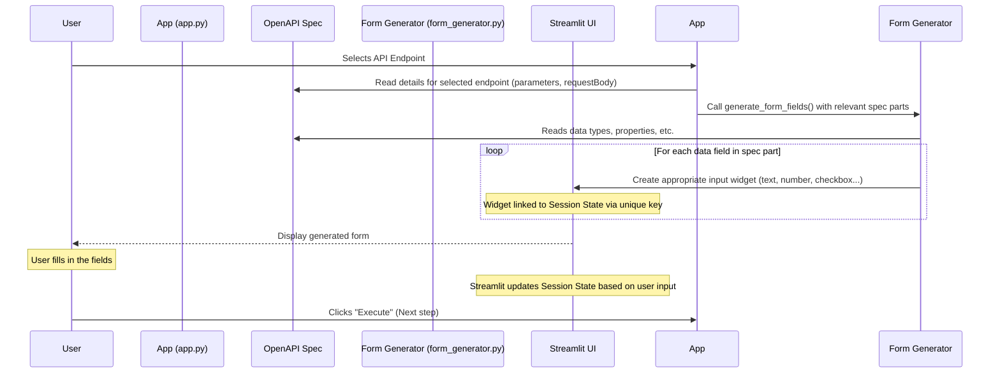

# Chapter 2: Dynamic Form Generation

In the [previous chapter](01_openapi_specification_.md), we learned that the OpenAPI Specification is the blueprint of an API, detailing its structure, available endpoints, and what data is needed for each. `openapi-custom-interface` uses this blueprint as its foundation.

But how do we, as users, provide the specific data required by an API endpoint? For example, if an endpoint needs an `item_id` (a number) and a `quantity` (also a number) to place an order, how does the application know to ask you for exactly those two pieces of information, and to expect numbers?

One way would be for the developer of `openapi-custom-interface` to manually build input forms for *every possible API endpoint* they might encounter. This is clearly impossible! APIs are diverse, and their data requirements vary wildly.

This is where **Dynamic Form Generation** comes in.

### What is Dynamic Form Generation?

Dynamic Form Generation is the intelligence that allows `openapi-custom-interface` to look at the API blueprint (the OpenAPI Specification) and *automatically* create the necessary input fields (like text boxes, number inputs, checkboxes, etc.) right before your eyes, without needing pre-built forms for specific APIs.

Think back to our restaurant menu analogy. If the OpenAPI Spec is the menu, then dynamic form generation is like a super-smart waiter. When you point to a dish on the menu (an API endpoint), the waiter instantly knows:

*   Does this dish require asking about spicy level (a yes/no checkbox)?
*   Do you need to specify ingredients to exclude (a list of text inputs)?
*   How many portions do you want (a number input)?
*   Does it come with side options (a dropdown menu)?

Instead of having a pre-printed order form for *every single dish*, the waiter reads the description of *this specific dish* on the menu and quickly assembles the right questions and places for you to write down your choices. That's dynamic form generation in action!

### How it Works: Reading the Blueprint for Inputs

When you select an API endpoint in `openapi-custom-interface`, the application dives into the OpenAPI Specification for that specific endpoint. It looks primarily at two sections that describe the input data:

1.  **`parameters`**: These define inputs that are usually part of the URL itself (path parameters or query parameters) or headers.
2.  **`requestBody`**: This defines the main data payload sent with requests like POST, PUT, or PATCH, often in JSON format.

For each piece of data defined in these sections, the specification describes its name, its location (`in: path`, `in: query`, `in: header`, `in: cookie` for parameters, or within the schema for `requestBody`), its `type` (like `string`, `number`, `integer`, `boolean`, `object`, `array`), its format, description, and whether it's `required`.

The dynamic form generation logic reads this information and decides which Streamlit input widget is the best fit for that specific data field.

### Building the Form: Mapping Spec to UI

Let's see how this mapping works for common data types defined in the OpenAPI spec:

| OpenAPI Schema Type | Best Fit Streamlit Widget | How it Works                                                                 |
| :------------------ | :------------------------ | :--------------------------------------------------------------------------- |
| `string`            | `st.text_input`           | Creates a simple text box.                                                   |
| `string` (`enum`)   | `st.selectbox`            | If the spec lists allowed values (`enum`), creates a dropdown.               |
| `string` (`format: password`) | `st.text_input(type="password")` | Creates a text box that hides input.                                         |
| `integer`           | `st.number_input`         | Creates an input box specifically for whole numbers.                         |
| `number`            | `st.number_input`         | Creates an input box for decimal numbers.                                    |
| `boolean`           | `st.toggle` (or `st.checkbox`) | Creates a switch or checkbox for true/false values.                          |
| `object`            | Nested structure          | The tool recursively looks at the object's `properties` and generates fields for each property inside a logical grouping. |
| `array`             | List of fields or JSON area | The tool generates input fields for the items *within* the array. If items are simple, a JSON text area might be shown; if items are objects, it allows adding/removing groups of nested fields. |

### How it Looks in the Code (Simplified)

When the `app.py` script processes an endpoint and finds a `requestBody` with a JSON schema (often referenced from the `components` section of the spec), it calls a function like `generate_form_fields`.

Here's a simplified look at how the `generate_form_fields` function in `ui_components/form_generator.py` might handle different schema types:

```python
# --- Simplified Snippet from ui_components/form_generator.py ---
import streamlit as st
# ... other imports and utility functions

def generate_form_fields(schema_obj, # The piece of the spec describing the data
                         key_prefix,  # Helps create unique keys for Streamlit state
                         data_path_list, # Tracks current position in the data structure
                         endpoint_id, # Which endpoint this form belongs to
                         spec_root # The full spec for resolving references
                         # ... other parameters like includes, suffix
                        ):

    if not isinstance(schema_obj, dict):
        return # Stop if schema object is not valid

    schema_type = schema_obj.get("type")
    prop_name = data_path_list[-1] if data_path_list else "Root" # Get the field name

    # Create a unique key for this field using its path
    field_key = f"{endpoint_id}_value__{'__'.join(map(str,data_path_list))}" # Simplified key structure

    field_label = f"`{prop_name}` ({schema_type or 'unknown'})"
    field_desc = schema_obj.get("description", "")

    if schema_type == "object":
        # If it's an object, iterate through its properties
        st.markdown(f"**{prop_name.capitalize()}:**")
        for sub_prop_name, sub_prop_schema in schema_obj.get("properties", {}).items():
            # Resolve references like $ref if needed (handled by resolve_ref utility)
            actual_sub_prop_schema = sub_prop_schema # Simplified: Imagine this resolves $ref

            # Recursively call generate_form_fields for the nested property
            generate_form_fields(
                actual_sub_prop_schema,
                f"{key_prefix}_{sub_prop_name}",
                data_path_list + [sub_prop_name], # Add sub-property name to path
                endpoint_id,
                spec_root
                # ... pass other parameters
            )

    elif schema_type == "array":
        st.markdown(f"**{prop_name.capitalize()} (Array):**")
        # Logic for handling arrays - might show text area for simple arrays
        # or complex UI for arrays of objects (not shown here for simplicity)
        st.caption("Input for arrays simplified: enter as JSON string below")
        # Use text_area for array JSON input
        st.text_area(f"JSON Array for `{prop_name}`:", key=field_key, height=100, help=field_desc)


    # --- Handling Simple Types ---
    elif schema_type == "integer":
        st.number_input(field_label, key=field_key, step=1, help=field_desc)

    elif schema_type == "number":
         st.number_input(field_label, key=field_key, format="%.2f", help=field_desc)

    elif schema_type == "boolean":
         st.toggle(field_label, key=field_key, help=field_desc)

    elif schema_type == "string":
        if "enum" in schema_obj:
             # Use selectbox if there are predefined options (enum)
             st.selectbox(field_label, options=schema_obj["enum"], key=field_key, help=field_desc)
        else:
             # Otherwise, use a standard text input
             st.text_input(field_label, key=field_key, help=field_desc)
    else:
        # Fallback for unknown types
        st.text_input(f"{field_label} (Unsupported Type)", key=field_key, help=field_desc)

    # ... more logic for required fields, default values, includes, etc.
```

This simplified code shows the core idea: the function receives a description of a data field (`schema_obj`), determines its `type`, and then calls the appropriate `streamlit` function (`st.number_input`, `st.toggle`, etc.) to draw the corresponding input widget on the page.

Notice the `key=field_key` parameter passed to every Streamlit input widget. This is crucial! Streamlit uses these unique keys to remember the value entered by the user across interactions. This is managed by [Streamlit Session State](04_streamlit_session_state_.md), which we'll cover in a later chapter. For now, just know that this `key` ensures the value you type stays there until you change it or the form is reset.

For complex types like `object` and `array`, the function calls *itself* (`generate_form_fields`) to build nested fields, creating the hierarchical forms you see for request bodies with complex structures.

### Collecting the Input

As you type into these dynamically generated fields, Streamlit automatically updates their values in the application's memory (specifically, in the session state, linked to those unique keys).

When you click the "Execute" button for an endpoint, the application then reads all the values currently stored in the session state for that endpoint's fields. It uses another function (`build_json_from_form` in `ui_components/form_generator.py`) that traverses the *original schema structure* again, but this time, instead of drawing fields, it collects the values linked by the keys and assembles them into the correct data format required by the API (e.g., a Python dictionary that will be sent as JSON).

### The Process Visualized

Here's a simplified flow of how dynamic forms are generated:



This diagram shows that the form isn't hardcoded; it's constructed on the fly by the `Form Generator` component reading the `OpenAPI Spec` and telling the `Streamlit UI` which widgets to display and how to key them.

### In Summary

Dynamic Form Generation is a powerful technique that makes `openapi-custom-interface` incredibly flexible. By reading the OpenAPI Specification, the tool can automatically create the correct input fields for any endpoint, regardless of the specific API it's interacting with. This saves immense development time and allows the client to adapt to different APIs seamlessly. The key is mapping the data types and structures defined in the spec to the appropriate user interface elements, and using unique keys (tied to [Streamlit Session State](04_streamlit_session_state_.md)) to manage the user's input values.

Now that we know how the application figures out what information it needs and builds the interface for you to provide it, let's look at another crucial aspect of interacting with many APIs: proving who you are, or **Authentication Management**.

[Next Chapter: Authentication Management](03_authentication_management_.md)

---

<sub><sup>**References**: [[1]](https://github.com/hugopessolano/openapi-custom-interface/blob/be95afbff2ecf7f0737b1bc47e9a292695080abe/app.py), [[2]](https://github.com/hugopessolano/openapi-custom-interface/blob/be95afbff2ecf7f0737b1bc47e9a292695080abe/ui_components/form_generator.py)</sup></sub>