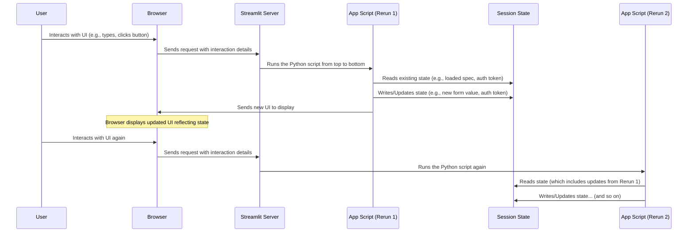

# Chapter 4: Streamlit Session State

In the [previous chapter](03_authentication_management_.md), we learned how `openapi-custom-interface` handles authentication, particularly by obtaining an authentication token after a successful login. But if you think about how Streamlit works, a question might arise: if the entire script runs from top to bottom every time you interact with the app (like clicking a button or typing in a box), how does the application *remember* things like:

*   The OpenAPI Specification you just loaded?
*   The authentication token you received?
*   The values you typed into all those dynamically generated form fields?
*   Which section of the API endpoints you had open?

If variables just reset each time, the app would be useless! You'd have to reload the spec, log in, and re-type everything for *every single API call*. This is where **Streamlit Session State** comes to the rescue.

### What is Streamlit Session State?

Imagine Streamlit Session State as a **temporary, persistent memory** or a **scratchpad** that belongs uniquely to *your* browser session. When you interact with a Streamlit app, a session starts for you. Streamlit provides a special object, `st.session_state`, which is like a Python dictionary specifically for that session.

```python
# Think of it like this, but it's managed by Streamlit behind the scenes:
# st.session_state = {
#     'key1': value1,
#     'key2': value2,
#     # ... and so on ...
# }
```

This dictionary is the key to making your Streamlit app feel dynamic and stateful. Unlike regular Python variables that reset with each script rerun, the values stored in `st.session_state` **persist** across reruns for the same user session.

### Why is Session State Necessary for this Project?

Streamlit apps are **stateless by default**. This means that without `st.session_state` (or other persistence methods), any variable you define at the top level of your script or inside a function would be re-initialized every time a user action causes a rerun.

For `openapi-custom-interface`, this stateless nature would be a major problem:

*   **Loading the API Spec:** When you enter the API URL and click "Load API", the `load_api_spec` function fetches the spec. Where does it put it so other parts of the app can use it in subsequent reruns (like displaying endpoints, generating forms)? It stores it in `st.session_state`.
*   **Authentication:** When the login endpoint is executed and returns a token, how does the application keep that token ready to be automatically included in the headers of *future* requests? It stores it in `st.session_state.auth_token`.
*   **Dynamic Forms:** As you type values into the input fields dynamically generated from the OpenAPI Spec (as seen in [Chapter 2](02_dynamic_form_generation_.md)), how does Streamlit remember what you typed when the script reruns? Streamlit widgets, when given a unique `key`, automatically manage their value in `st.session_state[key]`.
*   **UI State:** Remembering which group of endpoints you selected or which endpoint expander is open also relies on storing that state in `st.session_state`.

Essentially, `st.session_state` is the central hub where all the important, long-lived information for your current interaction with the API client is stored.

### How to Use Session State (Basic Concepts)

Using `st.session_state` is very similar to working with a Python dictionary:

1.  **Initialization:** It's good practice to initialize keys you plan to use, setting a default value if they don't exist yet. This prevents `KeyError` if you try to access a key before it's been set. The `state_manager.py` file handles this for the main app state.

    ```python
    # --- Snippet from state_manager.py ---
    import streamlit as st

    def initialize_session_state():
        # ... default_states dictionary defined with initial values ...
        default_states = {
            'openapi_spec': None, # Starts as None
            'auth_token': None,   # Starts as None
            # ... other states ...
            'form_field_values': {}, # Starts as empty dictionary
        }

        for key, value in default_states.items():
            if key not in st.session_state:
                st.session_state[key] = value
    ```
    This `initialize_session_state()` function is called once at the very beginning of the `app.py` script. It checks if a key like `openapi_spec` exists in `st.session_state`. If not (which happens on the first run or after a refresh), it sets it to `None`.

2.  **Writing/Updating Values:** You update values just like updating a dictionary entry.

    ```python
    # --- Snippet from api_service.py (Simplified) ---
    def load_api_spec(api_base_url_input:str, api_json_location_input:str) -> None:
        # ... fetches spec_data ...
        st.session_state.openapi_spec = spec_data # Store the fetched spec
        st.session_state.grouped_endpoints = dict(grouped) # Store processed endpoints
        # ... handle success/error messages ...
    ```
    After successfully fetching and processing the OpenAPI spec, the `load_api_spec` function updates `st.session_state.openapi_spec` and `st.session_state.grouped_endpoints`. On the next script rerun (triggered by `st.rerun()`), the rest of the app can access this stored data.

    Another example is storing the authentication token:

    ```python
    # --- Snippet from api_service.py (Simplified) ---
    def execute_api_request(endpoint_info:dict, api_base_url:str, spec:dict) -> None:
        # ... makes login request ...
        if is_login_endpoint and api_response.status_code == 200:
             response_data = api_response.json()
             if isinstance(response_data, dict) and "access_token" in response_data:
                 st.session_state.auth_token = response_data["access_token"] # Store the token!
                 st.success("Autenticación exitosa!")
             # ... handle token not found ...
        # ... handle other responses ...
    ```
    Here, when the *login* endpoint is executed successfully, the code finds the `access_token` in the response and saves it directly into `st.session_state.auth_token`.

3.  **Reading Values:** You read values using dictionary access (`[]`) or the `.get()` method (safer if the key might not exist).

    ```python
    # --- Snippet from ui_components/sidebar.py (Simplified) ---
    def render_sidebar():
        with st.sidebar:
            st.header("🔑 Autenticación")
            # Check if auth_token exists in session state
            if st.session_state.get('auth_token'):
                st.success(f"Autenticado! Token: ...{st.session_state.auth_token[-6:]}")
                # ... show logout button ...
            else:
                st.info("No autenticado.")
            # ... rest of sidebar ...
    ```
    The sidebar logic simply checks `st.session_state.get('auth_token')`. If it finds a value (meaning the user logged in), it shows the success message and logout button. Otherwise, it shows "No autenticado".

    ```python
    # --- Snippet from app.py (Simplified) ---
    if st.session_state.get('grouped_endpoints') and st.session_state.get('current_api_url'):
        # If these exist in session state (meaning API was loaded)...
        api_base_url = st.session_state.current_api_url # Read the stored URL
        spec = st.session_state.openapi_spec         # Read the stored spec
        grouped_endpoints = st.session_state.grouped_endpoints # Read the stored endpoints
        # ... then proceed to render the endpoint list ...
    else:
        # Otherwise (e.g., on first load before spec is loaded)
        st.info("☝️ Carga una especificación API desde el panel lateral para comenzar.")
    ```
    The main part of `app.py` checks if `grouped_endpoints` and `current_api_url` are present in session state. If they are, it means the API specification has been loaded in a *previous* rerun, and the script can now retrieve the stored data and render the UI based on it.

4.  **Session State and Widgets (The `key` Parameter):** This is a very important interaction. Almost all Streamlit input widgets (`st.text_input`, `st.number_input`, `st.checkbox`, `st.selectbox`, etc.) have a `key` parameter. When you provide a *unique* string key to a widget, Streamlit automatically:

    *   Stores the widget's current value in `st.session_state[key]`.
    *   When the script reruns, if a widget with the same key exists, Streamlit initializes it with the value found in `st.session_state[key]`.

    This is how the values you type into form fields persist! The dynamic form generator ([Chapter 2](02_dynamic_form_generation_.md)) is careful to create unique keys for every input field based on the endpoint ID and the field's path within the request body/parameters.

    ```python
    # --- Snippet from ui_components/form_generator.py (Simplified) ---
    def generate_form_fields(...): # Simplified function signature
        # ... logic to determine field name and schema_type ...
        prop_name_simple = data_path_list[-1] # e.g., "username" or "quantity"
        # Create a unique key based on the endpoint and field path
        field_key = f"{endpoint_id}_value__{'__'.join(map(str,data_path_list))}{current_suffix_local}"

        if schema_type == "string":
            # Use the unique key for the text input
            st.text_input(f"`{prop_name_simple}`", key=field_key, help=field_desc)
        elif schema_type == "integer":
            # Use the unique key for the number input
            st.number_input(f"`{prop_name_simple}`", key=field_key, step=1, help=field_desc)
        # ... other field types ...

        # The value typed by the user will be automatically stored/retrieved from
        # st.session_state[field_key]
        # The build_json_from_form function (also in form_generator.py)
        # reads these values directly from st.session_state based on the keys
    ```
    When you type into the text input generated by this code, Streamlit automatically puts that string value into `st.session_state[field_key]`. When you click "Execute", the script reruns, `generate_form_fields` runs again, finds the same `field_key`, retrieves the stored value from `st.session_state`, and initializes the `st.text_input` with that value. Meanwhile, `build_json_from_form` also knows these keys and collects the values from `st.session_state` to build the JSON payload.

### Session State Flow Visualized

Here's a simplified look at how Session State bridges the gap between user interactions and script reruns:


This diagram highlights that the Python script runs independently on each interaction, but `Session State` acts as the shared memory store that survives between these runs for a specific user.

### In Summary

Streamlit Session State (`st.session_state`) is a dictionary-like object that provides persistent storage across script reruns for a single user session. In `openapi-custom-interface`, it's fundamental for remembering the loaded API specification, managing the authentication token, storing values entered into dynamic forms, and maintaining the state of UI elements like expanders and tabs. By leveraging Session State, the application can provide a smooth, interactive experience despite Streamlit's stateless execution model.

Now that we understand how the application remembers important information across interactions using Session State, let's delve into the component responsible for the actual communication with the external API: the **API Service**.

[Next Chapter: API Service](05_api_service_.md)

---

<sub><sup>**References**: [[1]](https://github.com/hugopessolano/openapi-custom-interface/blob/be95afbff2ecf7f0737b1bc47e9a292695080abe/api_service.py), [[2]](https://github.com/hugopessolano/openapi-custom-interface/blob/be95afbff2ecf7f0737b1bc47e9a292695080abe/app.py), [[3]](https://github.com/hugopessolano/openapi-custom-interface/blob/be95afbff2ecf7f0737b1bc47e9a292695080abe/state_manager.py), [[4]](https://github.com/hugopessolano/openapi-custom-interface/blob/be95afbff2ecf7f0737b1bc47e9a292695080abe/ui_components/detail_dialog.py), [[5]](https://github.com/hugopessolano/openapi-custom-interface/blob/be95afbff2ecf7f0737b1bc47e9a292695080abe/ui_components/form_generator.py), [[6]](https://github.com/hugopessolano/openapi-custom-interface/blob/be95afbff2ecf7f0737b1bc47e9a292695080abe/ui_components/response_display.py), [[7]](https://github.com/hugopessolano/openapi-custom-interface/blob/be95afbff2ecf7f0737b1bc47e9a292695080abe/ui_components/sidebar.py)</sup></sub>