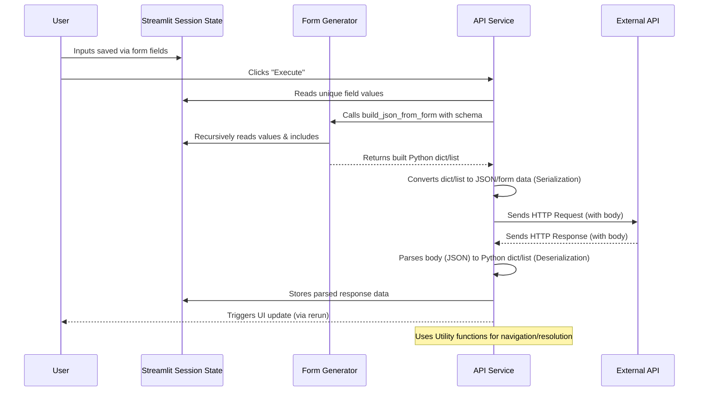

# Chapter 6: Request & Response Data Handling

In the [previous chapter](05_api_service_.md), we looked at the **API Service**, the component responsible for the crucial task of actually sending HTTP requests to the external API and receiving responses back. We saw how it orchestrates the process using the information gathered by [Dynamic Form Generation](02_dynamic_form_generation_.md) and stored in [Streamlit Session State](04_streamlit_session_state_.md), along with managing [Authentication](03_authentication_management_.md).

But let's zoom in on a critical part of that process: the **data** itself. What happens to the values you carefully typed into the dynamic form fields *before* they are sent? And once the API server sends data back, how does the application understand and process it?

This is where **Request & Response Data Handling** comes into play. This layer focuses specifically on transforming data: taking your input and structuring it correctly for the API, and taking the API's response and making it usable within the application.

### What is Request & Response Data Handling?

This part of the `openapi-custom-interface` project deals with the mechanics of:

1.  **Serialization (Request):** Taking the structured information (like a Python dictionary created from your form inputs) and converting it into a format the API expects, such as a JSON string or `form-urlencoded` key-value pairs.
2.  **Deserialization (Response):** Taking the raw response data received from the API (like a JSON string) and converting it back into a usable structure within the application, typically a Python dictionary or list.
3.  **Navigating Data Structures:** Using helper tools to easily find specific pieces of information within the potentially deeply nested structures defined in the OpenAPI Specification or returned in API responses.

Think of it like language translation. When you fill out the form, you're speaking the application's internal language (values linked to field keys in Session State). Request data handling translates that into the API's language (JSON, form data). When the API responds, it's speaking its language (JSON text). Response data handling translates that back into the application's language (a Python dictionary/list) so it can be understood and displayed.

### Handling Request Data: From Form to Body

The application uses the OpenAPI Specification ([Chapter 1](01_openapi_specification_.md)) to understand *exactly* what structure the API expects for its request body (if it has one). This structure is defined using a **schema**, which can describe simple types (strings, numbers) or complex nested **objects** and **arrays**.

When you click "Execute", the `execute_api_request` function ([Chapter 5](05_api_service_.md)) needs to build the request body according to this schema, using the values you entered into the form fields that were generated based on that same schema ([Chapter 2](02_dynamic_form_generation_.md)).

The values you entered aren't directly in a JSON structure yet; they are stored individually in [Streamlit Session State](04_streamlit_session_state_.md), linked by unique keys (e.g., `endpoint_abc_value__user__address__city__somesuffix`). The task is to take these scattered values and reassemble them into the correct object/array hierarchy specified by the API's schema.

This reassembly is primarily handled by the `build_json_from_form` function located in `ui_components/form_generator.py`.

#### How `build_json_from_form` Works (Simplified)

The `build_json_from_form` function essentially walks through the structure of the *request body schema* defined in the OpenAPI Specification. For each part of the schema (each property in an object, each item in an array):

1.  It constructs the expected unique key that the corresponding form field would have used when it was generated ([Chapter 2](02_dynamic_form_generation_.md)).
2.  It looks up the value stored under that key in `st.session_state.form_field_values` ([Chapter 4](04_streamlit_session_state_.md)).
3.  It also checks `st.session_state.form_field_includes` to see if this optional field was marked for inclusion.
4.  Based on the schema's type (object, array, string, number, etc.), it decides how to process the value.
5.  If the schema describes a nested `object` or `array` (especially an array of objects), it calls *itself* recursively to build that nested part of the structure.
6.  For simple types, it just includes the value retrieved from Session State (or skips it if it wasn't included).
7.  It assembles these pieces into a Python dictionary or list that matches the schema's required structure.

This resulting Python dictionary/list is then passed to the `requests` library by the `execute_api_request` function. If the `Content-Type` is `application/json`, `requests` automatically handles the final step of converting the Python dictionary/list into a JSON string before sending it in the HTTP request body. If the `Content-Type` is `application/x-www-form-urlencoded`, it prepares the data as key-value pairs.

#### Simplified `build_json_from_form` Snippet

Here's a highly simplified look at the core recursive logic in `build_json_from_form`:

```python
# --- Simplified Snippet from ui_components/form_generator.py ---
import streamlit as st
import json # Needed for simple array parsing
from utils import get_nested_value, resolve_ref # Utility to get values and follow $ref

def build_json_from_form(endpoint_id, spec_root, request_body_schema):
    # Get the root dictionaries for stored values and include status
    form_values_root = st.session_state.form_field_values.get(endpoint_id, {})
    form_includes_root = st.session_state.form_field_includes.get(endpoint_id, {})

    # Helper recursive function
    def recurse_build(current_values_node, current_includes_node, current_schema_node):
        if not current_schema_node: return None # Stop if no schema

        schema_type = current_schema_node.get("type")

        if schema_type == "object":
            result_dict = {}
            # Loop through properties defined in the schema
            for prop_name, prop_schema_ref in current_schema_node.get("properties", {}).items():
                actual_prop_schema = resolve_ref(spec_root, prop_schema_ref["$ref"]) if "$ref" in prop_schema_ref else prop_schema_ref
                if not actual_prop_schema: continue

                # Check if this property was marked to be included
                include_status = current_includes_node.get(prop_name)
                if include_status:
                    # Recursively build the value for this property
                    built_prop = recurse_build(
                        current_values_node.get(prop_name, {}), # Get the values for this nested property
                        include_status if isinstance(include_status, (dict,list)) else True, # Pass nested includes
                        actual_prop_schema
                    )
                    if built_prop is not None: # Only include if it resulted in a value
                        result_dict[prop_name] = built_prop
            return result_dict if result_dict else None # Return dict or None if empty

        elif schema_type == "array":
            items_schema_ref = current_schema_node.get("items", {})
            actual_items_schema = resolve_ref(spec_root, items_schema_ref["$ref"]) if "$ref" in items_schema_ref else items_schema_ref

            if actual_items_schema and actual_items_schema.get("type") == "object":
                 # Handle array of objects (built by the generator into a list of dicts)
                 if isinstance(current_values_node, list) and isinstance(current_includes_node, list):
                     built_array_items = []
                     for idx, item_values in enumerate(current_values_node):
                         # Recursively build each item in the array
                         built_item = recurse_build(item_values, current_includes_node[idx], actual_items_schema)
                         if built_item is not None:
                              built_array_items.append(built_item)
                     return built_array_items
            else:
                 # Handle simple arrays (expected as JSON string from text area)
                 if isinstance(current_values_node, str):
                     try:
                         return json.loads(current_values_node) if current_values_node.strip() else []
                     except json.JSONDecodeError:
                         st.warning("Invalid JSON for array, sending empty list.")
                         return []
                 elif isinstance(current_values_node, list):
                     # If it's already a list (e.g. from default value), return it
                     return current_values_node
                 else:
                     return [] # Default to empty list

        else: # Handle simple types (string, number, boolean, etc.)
             # Retrieve the simple value using the full path (simplified here)
             # This is the value directly from st.session_state[field_key]
            return current_values_node # Return the scalar value

    # Start the recursion at the root of the request body schema
    return recurse_build(form_values_root, form_includes_root, request_body_schema)
```

This snippet illustrates how `build_json_from_form` mirrors the structure of the API schema (`current_schema_node`), reading values from the corresponding location in the session state structure (`current_values_node`) and building the `result_dict` or `built_array_items`. It handles the two main complex types (`object` and `array`) by calling itself, and simple types by just taking the value.

Path and query parameters are collected separately within `execute_api_request` itself, as they aren't part of a JSON/form body structure in the same way. The function reads their values directly from Session State using their unique keys and adds them to the request URL or the `params` dictionary for `requests`.

### Handling Response Data: From Raw Text to Usable Structure

Once the `requests` library receives the response from the API server in `execute_api_request` ([Chapter 5](05_api_service_.md)), it's often just a stream of bytes or text. The primary task of response data handling is to convert this raw response body into a structured format that the application can use, typically a Python dictionary or list if the content is JSON.

1.  **Receive Raw Response:** The `api_response` object from `requests.request` contains the raw data (`api_response.text` or `api_response.content`).
2.  **Check Content Type:** The application inspects the `Content-Type` header in the `api_response.headers`. If it indicates `application/json`, it knows the body *should* be JSON.
3.  **Parse JSON:** If JSON is expected, the `api_response.json()` method is called. This method uses Python's built-in `json` library to parse the JSON string into a Python dictionary (for JSON objects) or list (for JSON arrays).
4.  **Handle Parsing Errors:** If `api_response.json()` fails (because the body wasn't valid JSON even if the header said it was, or because the header was wrong), the application catches the `json.JSONDecodeError` and stores an error message instead of the parsed data.
5.  **Handle Non-JSON:** If the content type is not JSON, the application might store the raw text or indicate that it's an unsupported format.
6.  **Store Parsed Data:** The resulting Python dictionary, list, or error message is stored in `st.session_state.endpoint_responses`, associated with the ID of the endpoint that was called. This structured data is now easily accessible for displaying to the user.

#### Simplified Response Processing Snippet

```python
# --- Simplified Snippet from api_service.py (Inside execute_api_request, after requests.request) ---
    try:
        api_response = requests.request(method.upper(), full_url_req, **request_kwargs)

        # Check the content type header
        response_content_type = api_response.headers.get("Content-Type", "")
        response_data = None

        # If it's JSON, try to parse it
        if "application/json" in response_content_type:
            try:
                response_data = api_response.json() # This parses the JSON string
            except json.JSONDecodeError:
                # If parsing fails, store an error
                response_data = {
                    "error": "Response claimed to be JSON but was invalid.",
                    "status_code": api_response.status_code,
                    "raw_text": api_response.text
                }
        else:
            # If not JSON, store raw text or indicator
            response_data = {
                "error": f"Non-JSON content received: {response_content_type}",
                "status_code": api_response.status_code,
                "raw_text": api_response.text
            }

        # Store the processed (or errored) response data in session state
        st.session_state.endpoint_responses[endpoint_id] = response_data

        # ... (rest of the response handling, like checking for login token) ...

    except requests.exceptions.RequestException as e_req:
        # Handle network errors before receiving a response
        st.error(f"API Error: {e_req}")
        st.session_state.endpoint_responses[endpoint_id] = {"error": f"Request Exception: {e_req}"}

    st.rerun() # Update the UI (will read the stored response)
```

This snippet shows how the `requests` library's `.json()` method is used for deserialization and how potential errors during this process are handled. The resulting Python object (`response_data`) is what the rest of the application, particularly the response display logic, will work with.

### Navigating Nested Data Structures: The Utility Belt

OpenAPI Specifications and API responses often involve complex, nested structures of objects within objects, or arrays containing objects, and so on. Finding a specific piece of information within these structures using standard Python dictionary/list access (`data['users'][0]['address']['city']`) can be cumbersome, especially when dealing with optional or potentially missing keys.

The `utils.py` file in the project provides helper functions specifically for navigating and manipulating these nested structures robustly.

| Utility Function   | Purpose                                                                 | Analogy                                        |
| :----------------- | :---------------------------------------------------------------------- | :--------------------------------------------- |
| `resolve_ref(spec, ref_string)` | Follows `$ref` pointers in the OpenAPI spec to find the actual schema definition. | Following a link in a document to find the full description elsewhere. |
| `get_nested_value(data, path_list, default)` | Retrieves a value from a nested dictionary/list using a list of keys/indices (a "path"), returning a default if any part of the path doesn't exist. | Using a GPS route (the path) to find a specific building (the value) in a city (the data structure), and giving up and returning a default if the path is blocked or doesn't exist. |
| `set_nested_value(data, path_list, value)` | Sets a value in a nested dictionary/list using a path, creating intermediate dictionaries/lists if necessary. | Creating the necessary streets and buildings along a route (the path) to place a new item (the value) at the final destination. |
| `deep_merge(source, destination)` | Merges two nested dictionaries, recursively combining nested objects. | Combining two maps of cities, merging details where streets/buildings overlap. |

These utilities are used throughout the application, not just in data handling. `build_json_from_form` uses `get_nested_value` and `set_nested_value` to interact with the potentially deeply nested structures in `st.session_state.form_field_values` and `st.session_state.form_field_includes`. `api_service.py` uses `resolve_ref` to get the full schema definitions from the spec when building requests. The response display code ([Chapter 7](07_api_response_display_.md)) also uses these to navigate the received JSON response data.

#### Simple `get_nested_value` Example

```python
# --- Simplified Snippet from utils.py ---
def get_nested_value(data_dict, path_list, default=None):
    current = data_dict
    for key_or_index in path_list:
        # Check if current is dict AND key exists, OR current is list AND index is valid
        if isinstance(current, dict) and isinstance(key_or_index, str) and key_or_index in current:
            current = current[key_or_index] # Move deeper into the dict
        elif isinstance(current, list) and isinstance(key_or_index, int) and 0 <= key_or_index < len(current):
            current = current[key_or_index] # Move deeper into the list
        else:
            return default # Path failed, return default
    return current # Found the value

# Example Usage (not in actual app code, just for illustration)
data = {"user": {"address": {"city": "London"}}}
city = get_nested_value(data, ["user", "address", "city"]) # Returns "London"
state = get_nested_value(data, ["user", "address", "state"], default="Unknown") # Returns "Unknown"
zip_code = get_nested_value(data, ["user", "zip_code"], default="N/A") # Returns "N/A"
```

This utility allows the application to safely access potentially nested data points based on a list representing the path through the structure, without crashing if a key or index is missing along the way.

### Data Handling Flow Visualized



This diagram shows the two-way flow of data: building the request body *from* Session State based on the schema, and parsing the response body *into* Session State for later display.

### In Summary

Request & Response Data Handling is the crucial layer that translates information between the application's internal memory ([Streamlit Session State](04_streamlit_session_state_.md) linked to form fields from [Dynamic Form Generation](02_dynamic_form_generation_.md)) and the formats required or returned by the external API (JSON, form-urlencoded). It leverages the structure defined in the [OpenAPI Specification](01_openapi_specification_.md) to correctly assemble request bodies and parse response bodies. Helper utilities make navigating potentially complex, nested data structures easier and more robust.

Now that we understand how the data is prepared before sending and processed after receiving, let's move on to how that processed response data is presented to the user in a clear and understandable way.

[Next Chapter: API Response Display](07_api_response_display_.md)

---

<sub><sup>**References**: [[1]](https://github.com/hugopessolano/openapi-custom-interface/blob/be95afbff2ecf7f0737b1bc47e9a292695080abe/api_service.py), [[2]](https://github.com/hugopessolano/openapi-custom-interface/blob/be95afbff2ecf7f0737b1bc47e9a292695080abe/ui_components/form_generator.py), [[3]](https://github.com/hugopessolano/openapi-custom-interface/blob/be95afbff2ecf7f0737b1bc47e9a292695080abe/ui_components/response_display.py), [[4]](https://github.com/hugopessolano/openapi-custom-interface/blob/be95afbff2ecf7f0737b1bc47e9a292695080abe/utils.py)</sup></sub>