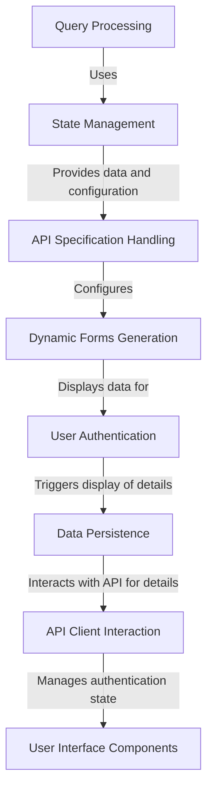

# Tutorial: openapi-custom-interface

The project is a web-based application designed for interacting with APIs, providing a user interface to easily manage API endpoints and their specifications. It supports authentication, allows users to input API URLs and locations of specification files, and displays detailed information about the loaded API. The application includes features for managing API requests and responses, including storing and displaying tabular data when applicable.

**Source Repository:** [https://github.com/hugopessolano/openapi-custom-interface](https://github.com/hugopessolano/openapi-custom-interface)

## Chapters

1. [User Interface Components
](01_user_interface_components_.md)
2. [User Authentication
](02_user_authentication_.md)
3. [API Specification Handling
](03_api_specification_handling_.md)
4. [Query Processing
](04_query_processing_.md)
5. [State Management
](05_state_management_.md)
6. [Data Persistence
](06_data_persistence_.md)
7. [API Client Interaction
](07_api_client_interaction_.md)
8. [Dynamic Forms Generation
](08_dynamic_forms_generation_.md)

---