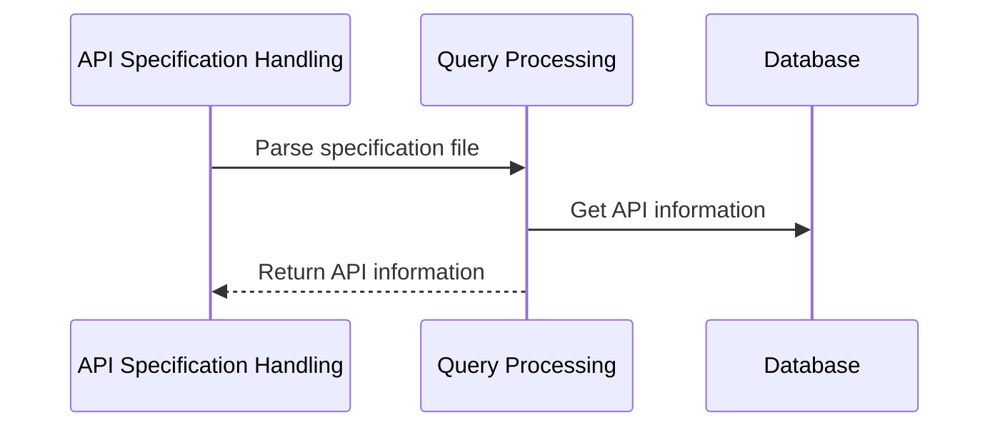

# Chapter 3: API Specification Handling

In the previous chapters, we learned how to perform user authentication and how to handle external APIs. Now, we will delve deeper into how to manage the specifications of these external APIs. This abstraction helps us efficiently schedule and use different API interfaces in our application.

## Central Use Case: Managing External APIs

Suppose we have an application that needs to interact with multiple external APIs, such as weather forecasts, social media data, etc. Each API has its specific specifications and access methods. To enable our application to easily switch and manage these APIs, we need a flexible and efficient method to handle API specifications.

## Key Concepts

### Importance of API Specifications

An API specification is a document or file that describes an API interface. It contains all necessary information about the API, such as Endpoints, Methods, Parameters, and Response Formats. By understanding and parsing these specifications, our application can automatically generate code templates for API calls, thereby simplifying the development process.

### How to Use API Specification Handling Use Case

Suppose we have an API specification file `openapi.json`. We can write a script to load and parse this specification file for use in our application. Here is a simple Python example:

```python
import json

def load_api_spec(file_path):
    with open(file_path, 'r') as file:
        spec = json.load(file)
        return spec

# Load API specification file
spec = load_api_spec('openapi.json')

# Now we can use this specification in the application
print(f"API Name: {spec['info']['title']}")
```

**Input**: Path to the `openapi.json` file.
**Output**: API name and other relevant information.

### Internal Implementation

Let's take a closer look at the specific implementation of this process:

1.  **Initialization**: Open the specification file and read its content, usually stored in JSON format.
2.  **Parsing**: Parse the JSON content into a Python dictionary for easy manipulation and access within the application.
3.  **Usage**: Through this dictionary, we can easily obtain information such as the API's name, version, endpoints, etc., to call the corresponding API interfaces in the application.



### Code Implementation

Here is a more detailed Python example showing how to load and use an API specification:

```python
import json

def load_api_spec(file_path):
    with open(file_path, 'r') as file:
        spec = json.load(file)
        return spec

# Example: Load API specification from a local JSON file
spec = load_api_spec('openapi.json')

# Print API name and version
print(f"API Name: {spec['info']['title']}")
print(f"API Version: {spec['info']['version']}")
```

In this example, we define a function `load_api_spec` to load and parse the specification file. By calling this function, we can obtain and print the API's name and version information.

## Conclusion

In this chapter, we learned how to handle and manage external API specifications. By understanding and parsing API specification files, our application can automatically generate code templates for API calls, thus simplifying the development process. We hope this chapter helps you better understand and apply API specification handling use cases.

Next, we will continue to explore Query Processing in the application, please look forward to [Chapter 4: Query Processing](next_chapter_filename).

---