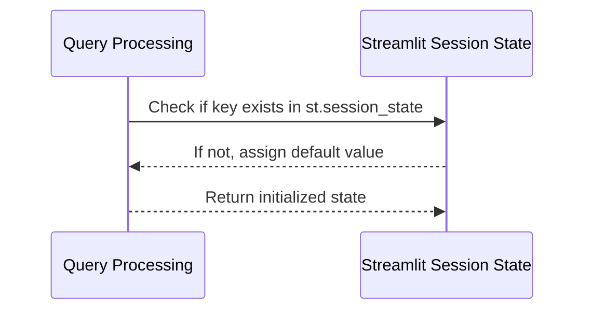

# Chapter 5: State Management

## Introduction
In the context of modern web applications, session state management is fundamental to providing a coherent and efficient user experience. This chapter will focus on how to abstract and manage session state in an application built with Streamlit, using a structure that facilitates its use and avoids common errors like `KeyError`.

## What is Session State?
Session state is a crucial part of web development as it allows relevant information to be maintained across different user interactions with the application. This is particularly useful when working with dynamic data, such as progress in a form or user configuration preferences.

## Key Concepts
### 1. `st.session_state`
Streamlit provides a simple way to manage session state through the global variable `st.session_state`. This variable allows data to be stored and retrieved between different application runs or different parts of the code.

### 2. Automatic Initialization
It is good practice to initialize the session state with default values to avoid errors when accessing keys that do not exist. This is done using a `for` loop that checks and assigns default values if the keys are not present in `st.session_state`.

## How to Use Session State?
### Basic Usage Example
```python
import streamlit as st

# Initialize session state with default values
def initialize_session_state():
    default_states = {
        'show_detail_dialog': False,
        'dialog_title': "Details", # Assuming "Detalles" was a UI string
        'dialog_data': None,
        # other default values...
    }

    for key, value in default_states.items():
        if key not in st.session_state:
            st.session_state[key] = value
```
This code snippet ensures that the necessary keys in the session state are present and have default values, making it easier to use them without worrying about null or non-existent values.

### Error Handling and Validation
To handle common errors like `KeyError`, it is crucial to initialize the session state correctly. This not only avoids these errors but also provides a solid foundation for any dynamic data the application may need.

## Internal Implementation
### Workflow
1.  **Initialization**: It is checked if the keys are present in `st.session_state`. If not, default values are assigned.
2.  **Retrieval and Use**: Once initialized, the session state can be retrieved or updated as needed.

### Sequence Diagram

This diagram shows how the logic checks each key and ensures all are present before use.

### Referenced Internal Code
```python
# In state_manager.py
def initialize_session_state():
    default_states = {
        'show_detail_dialog': False,
        'dialog_title': "Details",
        # other default values...
    }

    for key, value in default_states.items():
        if key not in st.session_state:
            st.session_state[key] = value
```
This code demonstrates how to ensure that all necessary keys are present in `st.session_state` with default values.

## Conclusion
Session state management is fundamental for a modern and user-friendly web application. By abstracting this process with Streamlit, accessing dynamic data and creating a consistent user experience is facilitated. This chapter has guided the reader through the basic use and internal implementation of `st.session_state` to ensure a robust and error-free session state.

For further exploration and advanced functionalities, continue with [Chapter 6: API Interaction](filename_chapter_6).

---