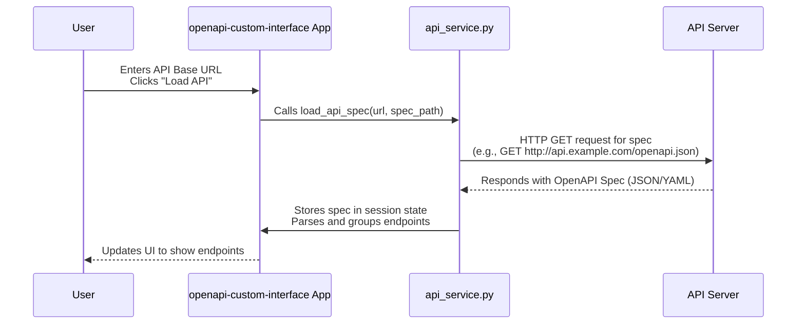

# Chapter 1: OpenAPI Specification

Imagine you want to order food from a new restaurant. You wouldn't just walk into the kitchen and guess what ingredients they have or how to prepare a dish! You'd look at a menu. The menu tells you what dishes are available, what's in them, and maybe even how they are prepared.

Interacting with an **API (Application Programming Interface)** is similar. An API is like a digital restaurant kitchen – it has resources and operations you can request. But how do you know what's available? What web address (URL) do you use? Do you need to send data, and if so, in what format?

Trying to figure this out manually for every API endpoint can be difficult and error-prone. This is where the **OpenAPI Specification** comes in.

### What is the OpenAPI Specification?

Think of the OpenAPI Specification as the **standard menu** or **blueprint** for an API. It's a document written in a standard format (usually JSON or YAML) that describes the *entire* API. It answers questions like:

*   What are the different web addresses (paths or endpoints) you can interact with?
*   What are the actions you can perform on each endpoint (like GET, POST, PUT, DELETE)?
*   What information do you need to send with your request (parameters, request body)?
*   What kind of response can you expect back?
*   How do you authenticate (prove who you are) if the API requires it?
*   And much more!

It's like a machine-readable contract that details all the capabilities and requirements of the API.

### How `openapi-custom-interface` Uses the OpenAPI Specification

The project you are using, `openapi-custom-interface`, is designed to make interacting with APIs much easier. Its core trick is that it doesn't need to be *specifically* programmed for every single API it interacts with. Instead, it relies entirely on that API's **OpenAPI Specification**.

Here's how it uses the specification:

1.  **Reads the Blueprint:** When you tell the tool where to find the API's OpenAPI Specification document (usually a URL ending in `/openapi.json` or `/docs/json`), the tool downloads and reads this blueprint.
2.  **Understands the API:** By reading the spec, the tool learns *everything* it needs to know about the API's structure and capabilities.
3.  **Builds the User Interface:** Based on the information in the spec, the tool dynamically creates the interactive elements you see in the application:
    *   It lists all the available API endpoints.
    *   It shows you the required method (GET, POST, etc.) for each endpoint.
    *   It automatically creates input fields for you to enter parameters or request body data based on what the spec says each endpoint expects.
    *   It knows how the response should be structured (which helps in displaying the response later).

Essentially, the OpenAPI Specification is the **foundation** upon which this entire application is built. Without it, the tool wouldn't know *anything* about the API and couldn't generate a user interface for it.

### Getting the Specification: The First Step

For `openapi-custom-interface` to do its magic, you first need to tell it *where* to find the OpenAPI Specification for the API you want to use. You provide the base URL of the API, and often, the tool can guess or you provide the path to the spec file (like `/openapi.json`).

Let's look at a simplified view of what happens when you provide the URL and click "Load API" in the sidebar:



This diagram shows the basic flow: the user tells the tool where the spec is, the tool fetches it from the API server, and then uses that information internally.

Looking at the code, the `api_service.py` file contains the function responsible for this: `load_api_spec`.

```python
# --- Snippet from api_service.py ---
def load_api_spec(api_base_url_input:str, api_json_location_input:str) -> None:

    # ... (resets session state - details not crucial here)

    if api_base_url_input:
        openapi_url = f"{api_base_url_input.rstrip('/')}/{api_json_location_input.lstrip('/')}"
        try:
            with st.spinner(f"Cargando especificación desde {openapi_url}..."):
                response = requests.get(openapi_url, timeout=15)
                response.raise_for_status() # Check for errors like 404
                spec_data: dict = response.json() # Parse the JSON response
                st.session_state.openapi_spec = spec_data # Store the spec

                # ... (code to process the spec - grouping endpoints etc.)

            st.success(f"API '{spec_data.get('info',{}).get('title','N/A')}' cargada exitosamente.")

        except requests.exceptions.RequestException as e:
            st.session_state.error_message = f"Error de red al cargar API: {e}"
        except json.JSONDecodeError as e:
            st.session_state.error_message = f"Error al parsear JSON de la API: {e}..."
        # ... (other error handling)
```

This snippet shows the core action: constructing the full URL for the spec, making a web request (`requests.get`), parsing the JSON response (`response.json()`), and storing it in `st.session_state.openapi_spec`. This stored dictionary `spec_data` is the OpenAPI Specification blueprint that the rest of the application will use.

The rest of the `load_api_spec` function (not fully shown here) goes on to process this `spec_data` dictionary, extracting information about paths, grouping them by tags, and storing this organized information (like `st.session_state.grouped_endpoints`) so the application can display the list of available API calls.

### In Summary

The OpenAPI Specification is the vital blueprint for any API you want to use with `openapi-custom-interface`. It provides all the necessary details about the API's structure and capabilities. The first step for the tool is to load and parse this specification document, which then allows it to understand the API and dynamically build the user interface you interact with.

Now that we understand the central role of the OpenAPI Specification, let's look at how the tool uses the information from this blueprint to automatically create input fields for you to interact with each part of the API.

[Next Chapter: Dynamic Form Generation](02_dynamic_form_generation_.md)

---

<sub><sup>**References**: [[1]](https://github.com/hugopessolano/openapi-custom-interface/blob/be95afbff2ecf7f0737b1bc47e9a292695080abe/api_service.py), [[2]](https://github.com/hugopessolano/openapi-custom-interface/blob/be95afbff2ecf7f0737b1bc47e9a292695080abe/app.py), [[3]](https://github.com/hugopessolano/openapi-custom-interface/blob/be95afbff2ecf7f0737b1bc47e9a292695080abe/utils.py)</sup></sub>