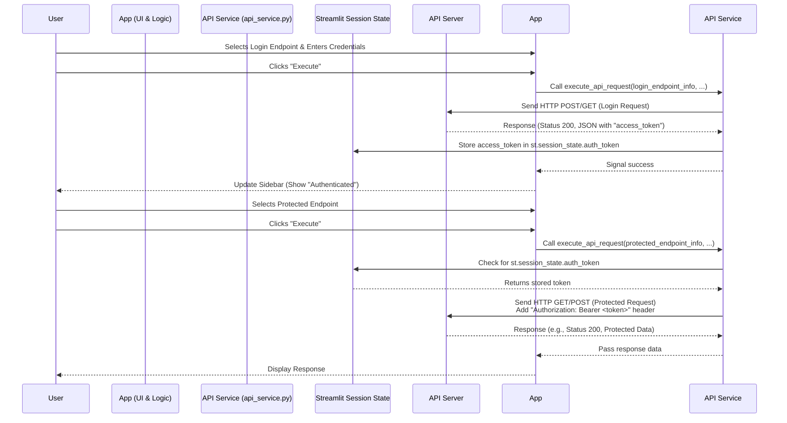

# Chapter 3: Authentication Management

In the [previous chapter](02_dynamic_form_generation_.md), we saw how `openapi-custom-interface` uses the OpenAPI Specification to dynamically build forms, allowing you to input data for any API endpoint. This is great for endpoints that are publicly available.

However, many APIs require you to prove who you are before you can access certain information or perform specific actions. Think about accessing your online banking account – you wouldn't expect to see your balance without logging in first! This process of proving your identity is called **authentication**.

For APIs, authentication often involves a login step where you provide credentials (like a username and password) to a specific endpoint. If successful, the API sends back a special key, often called an **authentication token**. This token is like a temporary ID card. For all subsequent requests to *protected* endpoints, you include this token to prove you are the logged-in user, instead of sending your username and password every single time.

This is where **Authentication Management** comes in. This chapter explains how `openapi-custom-interface` handles this crucial process: logging in, getting the token, using it for protected calls, and logging out.

### What is Authentication Management in this tool?

In the context of `openapi-custom-interface`, Authentication Management is about:

1.  **Identifying** which API endpoint is used for logging in.
2.  Using the dynamic form generation (from Chapter 2) to help you **send** your credentials to that login endpoint.
3.  **Receiving** the authentication token from the API's successful login response.
4.  **Storing** this token securely within the application (specifically, in [Streamlit Session State](04_streamlit_session_state_.md)).
5.  **Automatically including** this stored token in the headers of subsequent requests to endpoints that require authentication.
6.  Providing a way to **log out**, which simply means discarding the stored token.

### The Core Use Case: Logging In and Making a Protected Call

Let's walk through the most common scenario:

1.  You load an API that requires authentication.
2.  You need to find the "Login" or "Authenticate" endpoint.
3.  You use the dynamically generated form for *that specific login endpoint* to enter your username and password.
4.  You execute that request.
5.  If the login is successful, the API sends back a response containing your `access_token`.
6.  `openapi-custom-interface` detects this token, stores it internally, and updates the sidebar to show you're logged in.
7.  Now, when you select a *different*, protected endpoint and click "Execute", the tool automatically adds the stored token to the request headers before sending it to the API.

### How to Log In

The `openapi-custom-interface` application doesn't magically *know* which of the potentially hundreds of endpoints is the "login" one. You, the user, need to identify it from the list of endpoints provided (which comes from the OpenAPI Spec!). It's often named something obvious like `/login`, `/auth/token`, `/authenticate`, or `/oauth/token`.

Once you've found the login endpoint in the main list and expanded it, you'll see a form generated based on its requirements (likely fields for `username` and `password`).

1.  **Locate the Login Endpoint:** Browse the grouped endpoints (based on the spec loaded in Chapter 1) to find the one intended for authentication.
2.  **Fill the Login Form:** Use the dynamic form fields (generated as discussed in Chapter 2) to enter your API credentials (username, password, etc.).
3.  **Execute the Login Request:** Click the "Execute" button for that specific login endpoint.

If the API returns a successful response (usually status code 200) and that response body contains a key like `access_token` (this is a common pattern, especially for Bearer token authentication), the application will automatically:

*   Store the `access_token` in [Streamlit Session State](04_streamlit_session_state_.md) (`st.session_state.auth_token`).
*   Update the sidebar to show a "Logged in!" message.
*   Store any other user info returned by the login endpoint (`st.session_state.user_info`).

You can see the Authentication section in the sidebar updating:

```python
# --- Snippet from ui_components/sidebar.py ---
import streamlit as st
# ... other imports

def render_sidebar():
    with st.sidebar:
        st.header(f"🔑 Autenticación")
        if st.session_state.get('auth_token'):
            # Display logged-in status
            st.success(f"Autenticado! Token: ...{st.session_state.auth_token[-6:]}")
            if st.session_state.get('user_info') and "username" in st.session_state.user_info:
                st.caption(f"Usuario: {st.session_state.user_info['username']}")
            # Show logout button
            if st.button("Cerrar Sesión", key="logout_btn_suffix"): # Simplified key
                # Clear authentication state on logout
                st.session_state.auth_token = None
                st.session_state.auth_error = None
                st.session_state.user_info = {}
                # ... reset other related states ...
                st.rerun() # Refresh the UI

        else:
            # Display not logged-in status
            st.info("No autenticado.")
            if st.session_state.get('auth_error'):
                st.error(st.session_state.auth_error)
        # ... rest of sidebar rendering (API config) ...
```

This code snippet shows the basic Streamlit logic: checking `st.session_state.auth_token`. If it exists, show success and a logout button. If not, show not authenticated status. Clicking logout clears the token from session state.

### How the Token is Used (Automatically!)

Once `st.session_state.auth_token` contains a value, `openapi-custom-interface` uses this token *automatically* for subsequent requests.

When you click "Execute" on *any* endpoint (except potentially the login endpoint itself, to avoid infinite loops or sending a stale token), the `execute_api_request` function in `api_service.py` checks if a token exists in the session state. If it does, it adds a standard HTTP header to the request called `Authorization` with the value `Bearer YOUR_TOKEN_HERE`.

```python
# --- Simplified Snippet from api_service.py ---
import requests
import streamlit as st
# ... other imports

def execute_api_request(endpoint_info:dict, api_base_url:str, spec:dict) -> None:
    # ... (code to build URL, gather params, etc. - as seen in Chapter 2 context) ...

    headers_req = {"Accept": "application/json"} # Start with default headers

    # --- Authentication Logic ---
    # Check if this specific endpoint is likely the login endpoint (simplified check)
    # In the actual code, this check might be more robust
    is_login_endpoint = "login" in endpoint_info.get("operation",{}).get("operationId","").lower()

    # If we have a token AND this is NOT the login endpoint, add the Auth header
    if st.session_state.get('auth_token') and not is_login_endpoint:
        headers_req["Authorization"] = f"Bearer {st.session_state.auth_token}"
        st.caption("✨ Adding Authorization: Bearer token from session state") # User feedback

    # ... (code to build request body, add Content-Type header, etc.) ...

    request_kwargs["headers"] = headers_req # Add the headers to the request

    # --- Sending the request ---
    try:
        with st.spinner("Enviando solicitud API..."):
            api_response = requests.request(method.upper(), full_url_req, **request_kwargs)
        # ... (code to process response) ...

        # --- Processing Login Response ---
        if is_login_endpoint:
            if api_response.status_code == 200:
                 response_data = api_response.json() # Assuming JSON response for token
                 if isinstance(response_data, dict) and "access_token" in response_data:
                     st.session_state.auth_token = response_data["access_token"] # Store the token
                     st.session_state.auth_error = None
                     # Store other info if needed
                     st.session_state.user_info = {k: v for k, v in response_data.items() if k != "access_token"}
                     st.success("Autenticación exitosa!")
                 else:
                    st.session_state.auth_token = None # No token found
                    st.session_state.auth_error = "Login successful, but no 'access_token' found in response."
                    st.warning(st.session_state.auth_error)
            else:
                st.session_state.auth_token = None
                error_detail = api_response.text # Get error detail
                st.session_state.auth_error = f"Fallo en la autenticación ({api_response.status_code}). Detalle: {error_detail[:100]}..." # Truncate
                st.error(st.session_state.auth_error)

        # ... (code to handle other responses) ...

    except requests.exceptions.RequestException as e_req:
        # ... (error handling) ...
        st.session_state.auth_token = None # Clear token on network error? (Optional, depends on desired behavior)

    # ... (update UI, rerun) ...

```

This simplified code shows:
1.  A basic check to see if the currently executed endpoint is the login endpoint.
2.  If `st.session_state.auth_token` is set AND the endpoint is *not* the login, it adds the `Authorization: Bearer <token>` header.
3.  After sending the request, if it *was* identified as the login endpoint and the status is 200, it tries to parse the JSON response and store the value of the `access_token` key into `st.session_state.auth_token`.

This means that once you've successfully logged in via the appropriate endpoint, you don't need to think about authentication anymore for protected routes – the tool handles adding the token for you in the background.

### How to Log Out

Logging out is simple: you just need to remove the token from the application's memory. As shown in the sidebar code snippet above, clicking the "Cerrar Sesión" (Log Out) button triggers code that sets `st.session_state.auth_token = None`. This instantly removes the token, and the next protected request you try to make will fail with an authentication error from the API because the `Authorization` header will no longer be included.

### The Authentication Flow Visualized

Here's a simple sequence diagram showing the login and a subsequent protected request:



This diagram shows how the token is obtained, stored in Session State, and then automatically retrieved and added to subsequent requests by the API Service component.

### Storing the Token: A Quick Look at Session State

The magic behind remembering that you're logged in across different actions in the Streamlit app is the [Streamlit Session State](04_streamlit_session_state_.md). As briefly mentioned, the token is stored in `st.session_state.auth_token`.

```python
# --- Snippet from state_manager.py ---
import streamlit as st

def initialize_session_state():
    """
    Initializes necessary keys in Streamlit session state.
    """
    default_states = {
        # ... other states ...
        'auth_token': None, # This is where the authentication token is stored
        'auth_error': None, # Stores any error message during login
        'user_info': {},    # Stores additional info returned by login (like username)
        # ... other states ...
    }

    for key, value in default_states.items():
        if key not in st.session_state:
            st.session_state[key] = value
```

The `state_manager.py` file is responsible for ensuring these keys exist in the session state when the app starts. `auth_token` starts as `None`. When a successful login occurs, the `execute_api_request` function populates it with the token string. When you log out, the sidebar code sets it back to `None`.

This use of Session State is fundamental to how the application maintains state across user interactions without a traditional web server backend. We'll explore [Streamlit Session State](04_streamlit_session_state_.md) in much more detail in the next chapter.

### In Summary

Authentication Management in `openapi-custom-interface` allows you to easily interact with APIs that require a login. By leveraging the OpenAPI Specification to generate the login form and using [Streamlit Session State](04_streamlit_session_state_.md) to store the token, the application handles the complexity of including the authentication header for subsequent protected requests automatically. You just need to find the login endpoint, provide your credentials, and the tool does the rest until you choose to log out.

Understanding how the application uses Session State to keep track of things like the authentication token is key to seeing how it maintains state. Let's dive deeper into [Streamlit Session State](04_streamlit_session_state_.md) next.

[Next Chapter: Streamlit Session State](04_streamlit_session_state_.md)

---

<sub><sup>**References**: [[1]](https://github.com/hugopessolano/openapi-custom-interface/blob/be95afbff2ecf7f0737b1bc47e9a292695080abe/api_service.py), [[2]](https://github.com/hugopessolano/openapi-custom-interface/blob/be95afbff2ecf7f0737b1bc47e9a292695080abe/state_manager.py), [[3]](https://github.com/hugopessolano/openapi-custom-interface/blob/be95afbff2ecf7f0737b1bc47e9a292695080abe/ui_components/sidebar.py)</sup></sub>