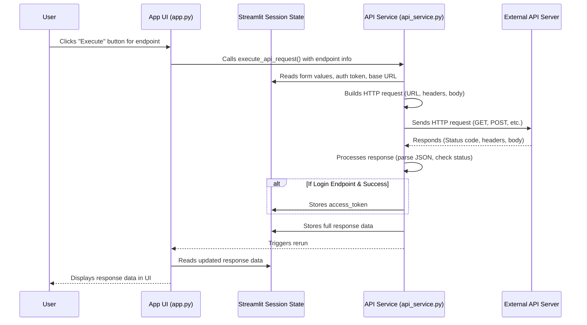

# Chapter 5: API Service

In the [previous chapter](04_streamlit_session_state_.md), we explored how [Streamlit Session State](04_streamlit_session_state_.md) allows `openapi-custom-interface` to remember important information, like the loaded API specification and the authentication token, across your interactions with the app. This "memory" is crucial for providing a smooth user experience.

But remembering things is only part of the puzzle. The main goal of this application is to actually **talk** to the external API you've specified! How does the information you've entered into the dynamic forms (using the principles from [Chapter 2: Dynamic Form Generation](02_dynamic_form_generation_.md)) and the authentication token you might have stored (from [Chapter 3: Authentication Management](03_authentication_management_.md)) get sent to the API server?

This is the job of the **API Service**.

### What is the API Service?

The API Service is the core **worker** module in `openapi-custom-interface` that handles the direct communication with the external API. Think of it as the messenger or the delivery person for your API requests.

Its responsibilities include:

1.  **Loading the Spec:** Initially fetching the OpenAPI Specification from the provided URL (as first seen in [Chapter 1: OpenAPI Specification](01_openapi_specification_.md)).
2.  **Preparing Requests:** Taking all the input data you've provided through the forms (parameters, request body) and the authentication token stored in [Streamlit Session State](04_streamlit_session_state_.md), and assembling them into a correctly formatted HTTP request.
3.  **Sending Requests:** Using a library (like `requests` in Python) to actually send the constructed HTTP request over the internet to the external API server.
4.  **Processing Responses:** Receiving the response back from the API server, checking things like the status code (e.g., 200 for success, 404 for not found, 500 for server error), parsing the response body (often JSON), and handling special cases like storing the authentication token after a successful login.
5.  **Storing Results:** Making the API response data available to the rest of the application (by storing it in [Streamlit Session State](04_streamlit_session_state_.md)) so it can be displayed to you.

Essentially, when you click the "Execute" button for an endpoint in the UI, you're telling the API Service to do its job.

### The Core Use Case: Sending an API Request

Let's revisit the fundamental action: making a call to an API endpoint.

1.  You've loaded the API Specification ([Chapter 1](01_openapi_specification_.md)).
2.  You've selected an endpoint and filled out the dynamic form fields ([Chapter 2](02_dynamic_form_generation_.md)), and these values are sitting in [Session State](04_streamlit_session_state_.md) ([Chapter 4](04_streamlit_session_state_.md)).
3.  You might have logged in and have an authentication token in [Session State](04_streamlit_session_state_.md) ([Chapter 3](03_authentication_management_.md)).
4.  You click the "Execute" button next to the endpoint.

This click triggers the API Service. The API Service will:

*   Read the endpoint details from the stored spec.
*   Read the values you typed from [Session State](04_streamlit_session_state_.md).
*   Read the authentication token from [Session State](04_streamlit_session_state_.md) (if it exists).
*   Build the full request (URL, headers, body).
*   Send it to the API.
*   Wait for the response.
*   Process the response (check for login token, parse data).
*   Store the response data in [Session State](04_streamlit_session_state_.md).
*   Signal the app to update the UI (show the response).

### How it Works Internally (Simplified)

The main function within the API Service module (`api_service.py`) that handles sending requests is `execute_api_request`. When you click the "Execute" button for an endpoint in `app.py`, it calls this function, passing details about the selected endpoint and the currently loaded spec.

Let's trace what happens inside `execute_api_request`:

1.  **Get Endpoint Info:** The function receives details about the chosen path, method (GET, POST, etc.), and the operation object from the OpenAPI spec.
2.  **Collect Input Data:** It looks up the unique keys generated for the form fields of *this specific endpoint* in `st.session_state` ([Chapter 4](04_streamlit_session_state_.md)). It retrieves the values you typed for path parameters, query parameters, and uses a helper function (`build_json_from_form` from `ui_components/form_generator.py`, which also reads Session State) to collect data for the request body.
3.  **Build URL:** It constructs the full URL by combining the base API URL (also from Session State) with the endpoint path, substituting any path parameters with the collected values. It also adds collected query parameters to the URL.
4.  **Prepare Headers:** It creates a dictionary for HTTP headers. Crucially, it checks `st.session_state.auth_token`. If a token exists *and* the current endpoint isn't the login endpoint, it adds the `Authorization: Bearer <token>` header ([Chapter 3](03_authentication_management_.md)). It also adds standard headers like `Accept: application/json`.
5.  **Prepare Request Body:** If the endpoint requires a request body (like for POST or PUT), it uses the data collected from the form fields (or raw JSON input) to create the request payload, ensuring the correct `Content-Type` header is set (e.g., `application/json`).
6.  **Send the Request:** It uses the `requests.request()` function from the popular `requests` library. This function is flexible enough to handle GET, POST, PUT, DELETE, etc., based on the method from the spec, and automatically includes the built URL, parameters, headers, and body.
7.  **Receive and Process Response:** `requests` waits for the API server's response. Once received, the API Service function examines the response:
    *   It checks the status code.
    *   It tries to parse the response body, assuming it's JSON if indicated by the `Content-Type` header.
    *   If the endpoint *was* identified as a login endpoint and the status code is 200, it specifically looks for an `access_token` in the JSON response and saves it to `st.session_state.auth_token` ([Chapter 3](03_authentication_management_.md)).
8.  **Store Response Data:** Regardless of success or failure (unless there's a network error), the API Service stores the response details (status code, headers, parsed body or error message) in `st.session_state.endpoint_responses`, keyed by the endpoint's unique ID. This is how the UI knows what happened and what data to display.
9.  **Update UI:** It triggers a `st.rerun()` to cause Streamlit to redraw the page, which will now read the newly stored response data from Session State and display it ([Chapter 7](07_api_response_display_.md)).

### API Call Flow Visualized

Here's a sequence diagram showing the interaction when an API request is executed:



This diagram illustrates how the API Service component is the central point for performing the actual network call, using Session State for both gathering input and storing the outcome.

### Code Snippets from `api_service.py`

Let's look at small parts of the `execute_api_request` function to see how it implements the steps above.

First, getting input and building the URL/parameters:

```python
# --- Snippet from api_service.py (Inside execute_api_request) ---
    path = endpoint_info["path"]
    method = endpoint_info["method"]
    operation = endpoint_info["operation"]
    endpoint_id = endpoint_info["id"]

    current_path_req = path
    query_params_req = {}
    path_params_missing = False

    # Loop through parameters defined in the spec
    if "parameters" in operation:
        for p_idx, param_schema in enumerate(operation["parameters"]):
            param_base_key = f"{endpoint_id}_p_{p_idx}_{param_schema['name']}{GLOBAL_SUFFIX}"
            # Get value from session state using the unique key
            param_value = st.session_state.get(f"{param_base_key}_{param_schema['in']}", "")

            if param_schema['in'] == 'path':
                # Replace placeholder in path string
                current_path_req = current_path_req.replace(f"{{{param_schema['name']}}}", str(param_value))
            elif param_schema['in'] == 'query':
                # Add to query params dictionary
                if param_value: # Only add if it has a value
                    query_params_req[param_schema['name']] = param_value

    # Combine base URL and path
    full_url_req = f"{api_base_url.rstrip('/')}{current_path_req}"

    # Prepare request arguments for 'requests' library
    request_kwargs = {
        "params": {k: v for k, v in query_params_req.items() if v is not None} or None,
        "timeout": 20 # Set a timeout for the request
    }
# --- End Snippet ---
```

This part shows how the function iterates through the parameters defined in the `operation` object from the spec, reads the corresponding values from `st.session_state` using the pre-defined keys (linked to the form fields), and uses them to build the `full_url_req` and `request_kwargs['params']` dictionary.

Next, adding authentication headers:

```python
# --- Snippet from api_service.py (Inside execute_api_request) ---
    headers_req = {"Accept": "application/json"} # Default header

    # Simplified check if this is likely the login endpoint
    is_login_endpoint = "login" in operation.get("operationId","").lower() or \
                        (operation.get("tags") and "auth" in [t.lower() for t in operation.get("tags",[])])

    # Check if we have a token AND it's not the login endpoint
    if st.session_state.get('auth_token') and not is_login_endpoint:
        # Add the Authorization header with the Bearer token from session state
        headers_req["Authorization"] = f"Bearer {st.session_state.auth_token}"

    request_kwargs["headers"] = headers_req # Add headers to the request arguments
# --- End Snippet ---
```

Here, the code checks if `st.session_state.auth_token` is not empty. If it's present, it adds the standard `Authorization: Bearer ...` header to the `headers_req` dictionary, which is then included in the `request_kwargs` sent to the `requests` library.

Finally, sending the request and handling the response (including login token handling):

```python
# --- Snippet from api_service.py (Inside execute_api_request) ---
    try:
        with st.spinner("Enviando solicitud API..."):
            # Use requests.request to send the actual HTTP call
            api_response = requests.request(method.upper(), full_url_req, **request_kwargs)

        # Process the response based on Content-Type (often JSON)
        response_content_type = api_response.headers.get("Content-Type", "")
        response_data = None
        if "application/json" in response_content_type:
            try:
                response_data = api_response.json() # Parse JSON body
            except json.JSONDecodeError:
                # Handle case where Content-Type is json but body isn't valid JSON
                 response_data = {"error": "Invalid JSON response"}
        else:
             # Handle non-JSON responses
            response_data = {"raw_text": api_response.text}

        # Store the response data (or error) in session state
        st.session_state.endpoint_responses[endpoint_id] = {
            "status_code": api_response.status_code,
            "headers": dict(api_response.headers),
            "body": response_data
        }

        # Special handling for the login endpoint
        if is_login_endpoint:
            if api_response.status_code == 200 and isinstance(response_data["body"], dict) and "access_token" in response_data["body"]:
                # If successful login and token found, store it!
                st.session_state.auth_token = response_data["body"]["access_token"]
                st.success("Autenticación exitosa!")
            else:
                # If login failed, clear token and show error
                st.session_state.auth_token = None
                st.error(f"Fallo en la autenticación ({api_response.status_code}).")

    except requests.exceptions.RequestException as e_req:
        # Handle network errors
        st.error(f"Error de API: {e_req}")
        st.session_state.endpoint_responses[endpoint_id] = {"error": f"Request Exception: {e_req}"}

    # Trigger a UI update to show the result
    st.session_state.active_expander_id = endpoint_id # Keep this endpoint open
    st.rerun()
# --- End Snippet ---
```

This final snippet shows the core `requests.request` call, how the response is received and processed (especially parsing JSON and the special logic for finding and storing the `access_token` if it's the login endpoint), how the full response is stored in `st.session_state`, and finally, the `st.rerun()` that updates the display.

### In Summary

The API Service is the operational heart of `openapi-custom-interface`. It is responsible for translating the user's intent (expressed through form inputs and clicking "Execute") and the application's state ([Session State](04_streamlit_session_state_.md)) into actual HTTP requests, sending them to the external API server, and then receiving, processing, and storing the API's response. It leverages information from the OpenAPI Specification, the user's input managed by [Dynamic Form Generation](02_dynamic_form_generation_.md), and the application's memory provided by [Streamlit Session State](04_streamlit_session_state_.md) and [Authentication Management](03_authentication_management_.md) to perform its crucial task.

Now that we understand *how* the API Service makes the call and gets a response, let's look more closely at the data itself – how the request data is finally put together from the various inputs, and how the response data is processed and prepared for display.

[Next Chapter: Request & Response Data Handling](06_request___response_data_handling_.md)

---

<sub><sup>**References**: [[1]](https://github.com/hugopessolano/openapi-custom-interface/blob/be95afbff2ecf7f0737b1bc47e9a292695080abe/api_service.py), [[2]](https://github.com/hugopessolano/openapi-custom-interface/blob/be95afbff2ecf7f0737b1bc47e9a292695080abe/app.py), [[3]](https://github.com/hugopessolano/openapi-custom-interface/blob/be95afbff2ecf7f0737b1bc47e9a292695080abe/ui_components/sidebar.py)</sup></sub>