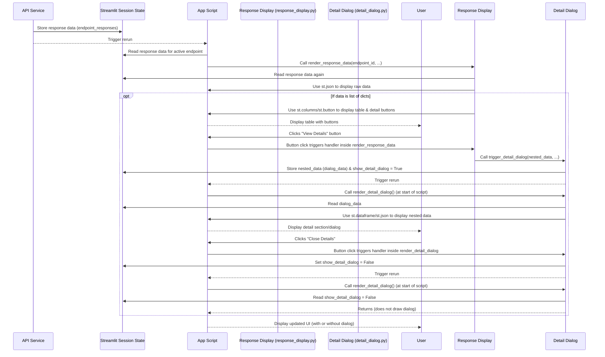

# Chapter 7: API Response Display

Welcome back! In the [previous chapter](06_request___response_data_handling_.md), we learned how `openapi-custom-interface` handles the **data** itself – taking your form inputs and structuring them correctly for the API request, and then receiving the API's response and parsing it into a usable format, usually a Python dictionary or list.

Now that the application has successfully called the API and has the response data ready in [Streamlit Session State](04_streamlit_session_state_.md), the next crucial step is showing it to you, the user, in a way that is easy to understand. Raw API responses, especially complex ones with many nested details, can be hard to read as plain text or even raw JSON.

This is the job of the **API Response Display**.

### What is API Response Display?

The API Response Display is the part of `openapi-custom-interface` responsible for taking the processed data received from the API Service ([Chapter 5](05_api_service_.md)) and presenting it clearly in the Streamlit user interface.

Think of it like presenting a complex report. Receiving the raw data is like getting a massive spreadsheet or a stack of papers ([Chapter 6](06_request___response_data_handling_.md)). The API Response Display is like the tool that takes that raw data and:

*   Shows you the overall result (like the status code – did it work?).
*   Displays the full raw content (like showing the whole raw spreadsheet).
*   If the data has a common, understandable structure (like a list of similar items), it presents it in a more organized way, like a summary table.
*   If there are lots of details hidden within the main items in the table (like specific details for each line item in the report), it provides a way to "drill down" and see those details without cluttering the main view.

### The Core Use Case: Seeing the Results of Your API Call

The most common scenario is simple: you execute an API request, and you want to see the result immediately below the form you just filled out.

1.  You've loaded the API ([Chapter 1](01_openapi_specification_.md)), selected an endpoint, filled the form ([Chapter 2](02_dynamic_form_generation_.md)), potentially handled authentication ([Chapter 3](03_authentication_management_.md)), and all your input and state are saved ([Chapter 4](04_streamlit_session_state_.md)).
2.  You clicked "Execute", and the API Service made the call ([Chapter 5](05_api_service_.md)) and stored the parsed response data in [Session State](04_streamlit_session_state_.md) ([Chapter 6](06_request___response_data_handling_.md)).
3.  The application triggers a rerun.
4.  The API Response Display component checks if there's a response stored for the current endpoint in Session State.
5.  If there is, it reads that data and draws the result section in the UI, showing the status code, the raw response, and potentially a nicely formatted table or other visualizations.

### How it Works (High-Level)

When you click "Execute", after the `execute_api_request` function finishes its job of calling the API and storing the result in `st.session_state.endpoint_responses`, it triggers `st.rerun()`.

The main `app.py` script reruns from the top. As it redraws the page, when it gets to the section for the specific endpoint you executed, it checks Streamlit Session State:

```python
# --- Simplified Snippet from app.py ---
# ... after generating the form fields for an endpoint ...

if st.button(button_label, key=f"{endpoint_id}_execute_button{GLOBAL_SUFFIX}"):
    execute_api_request(endpoint_info, api_base_url, spec)

# This line is crucial - it tells the UI to render the response if one exists
render_response_data(endpoint_id, tag_name_to_display)

# ... rest of app.py ...
```

The `app.py` script simply calls the `render_response_data` function, passing the unique ID of the current endpoint. This function, located in `ui_components/response_display.py`, contains all the logic for figuring out how to best display the response data associated with that `endpoint_id`.

Inside `render_response_data`:

1.  It looks up the response data for the given `endpoint_id` in `st.session_state.endpoint_responses`.
2.  If data is found, it first displays the basic response information (like "Response Status Code: 200") and the raw response body using `st.json` (which formats JSON nicely).
3.  It then examines the *structure* of the parsed response data (the Python dictionary or list).
4.  If the data is a Python `list` and all items in the list are `dict`s (a common pattern for "list all items" endpoints), it assumes this can be shown as a table.
5.  It prepares the data for tabular display. If any values within the list items are themselves nested dictionaries or lists, it replaces that value in the table view with a placeholder like "View Details" and associates a button with it.
6.  It uses Streamlit's layout features (`st.columns`) and potentially the Pandas library (`pd.DataFrame`, `st.dataframe`) to draw the table-like structure.
7.  If a user clicks one of the "View Details" buttons, it triggers another function (`trigger_detail_dialog` from `ui_components/detail_dialog.py`) which stores the *nested* data in Session State and sets a flag to open a separate detail view (a simple pop-up-like section on the page).
8.  The detail view function (`render_detail_dialog`), running because of the `st.rerun` triggered by the button click, reads the stored nested data and displays it, again using `st.dataframe` or `st.json`.

### Displaying Raw JSON

Even for complex responses or responses that aren't easily tabular, showing the raw JSON is always useful. Streamlit's `st.json()` function does an excellent job of pretty-printing JSON, making it much more readable than plain text.

```python
# --- Simplified Snippet from ui_components/response_display.py ---
import streamlit as st
# ... other imports ...

def render_response_data(endpoint_id, tag_name_to_display):
    # Get the stored response for this endpoint from session state
    response_data = st.session_state.get('endpoint_responses', {}).get(endpoint_id)

    if response_data:
        st.markdown("--- \n #### Response:")

        # Check if it's an error stored by api_service
        if isinstance(response_data, dict) and "error" in response_data:
            st.error(f"Error: {response_data.get('error')}")
            if response_data.get('status_code'):
                 st.caption(f"Status Code: {response_data.get('status_code')}")
            if response_data.get('raw_text'):
                 st.code(response_data.get('raw_text'), language='text')
            return # Stop here if it's an error message

        # Always show the raw response data (parsed JSON or fallback)
        st.write("Raw Response (JSON):")
        st.json(response_data) # Pretty-prints the Python dict/list as JSON

        # ... (rest of the function for tabular display) ...
```

This snippet shows the basic check for an existing response for the `endpoint_id`. If found, it displays a header and uses `st.json` to show the parsed data. `st.json` automatically handles Python dictionaries and lists, displaying them as formatted JSON text.

### Displaying Tabular Data (Lists of Objects)

If the response data is a list where each item is a dictionary, it often represents a collection of resources (like a list of users, products, or orders). This is ideal for displaying in a table. The code attempts to detect this structure and use Pandas DataFrames for display if the `pandas` library is installed.

Since Streamlit's `st.dataframe` or `st.table` can struggle with deeply nested structures or require specific data formats, the `render_response_data` function implements custom logic using `st.columns` and buttons to handle nested data within the table view.

```python
# --- Simplified Snippet from ui_components/response_display.py ---
# ... inside render_response_data, after showing raw JSON ...

        if PANDAS_AVAILABLE and pd: # Check if pandas is available
            st.markdown("--- \n **Tabular View (if applicable):**")

            # Check if the data is a list of dictionaries
            if isinstance(response_data, list) and response_data and all(isinstance(item, dict) for item in response_data):

                # Prepare data for the table, replacing nested objects/arrays with placeholders
                display_rows = []
                for original_item in response_data:
                    row_display = {}
                    for key, value in original_item.items():
                        # If value is nested, show placeholder and prepare button
                        if isinstance(value, (dict, list)) and value:
                            row_display[key] = f"See {key.capitalize()}" # Placeholder text
                        else:
                            row_display[key] = str(value) # Convert simple values to string
                    display_rows.append(row_display)

                if display_rows:
                    # Use st.dataframe for simple cases (if pandas handles it)
                    # or use st.columns for custom rendering with buttons
                    # (The actual code uses st.columns to ensure button handling)

                    # --- Custom Column/Button Rendering (Simplified logic) ---
                    st.write("Displaying list as table:")
                    # Assume all rows have the same keys for columns
                    columns_to_show = list(display_rows[0].keys())
                    cols = st.columns(len(columns_to_show)) # Create columns for header

                    # Display headers
                    for i, col_name in enumerate(columns_to_show):
                         cols[i].markdown(f"**{col_name}**")

                    st.divider() # Separator

                    # Display rows with buttons for nested data
                    for row_index, original_item in enumerate(response_data): # Iterate through original data
                         row_cols = st.columns(len(columns_to_show)) # Create columns for this row
                         for col_index, col_name in enumerate(columns_to_show):
                              cell_value = original_item.get(col_name) # Get original nested value

                              if isinstance(cell_value, (dict, list)) and cell_value:
                                  # If it's nested, show a button
                                  button_key = f"detail_btn_{endpoint_id}_{row_index}_{col_name}{GLOBAL_SUFFIX}"
                                  if row_cols[col_index].button(f"View {col_name.capitalize()}", key=button_key):
                                      # On button click, trigger the detail dialog
                                      trigger_detail_dialog(
                                          title=f"{col_name.capitalize()} (Item {row_index+1})",
                                          data=cell_value, # Pass the actual nested data
                                          current_endpoint_id=endpoint_id,
                                          current_tab_name=tag_name_to_display
                                      )
                              else:
                                  # If it's a simple value, just write it
                                  row_cols[col_index].write(str(original_item.get(col_name, ''))) # Write value

                         st.divider() # Separator between rows
                    # --- End Custom Rendering ---

            elif isinstance(response_data, dict):
                st.write("Displaying individual object with detail buttons:")
                 # Similar logic here for top-level object with nested properties
                for key, value in response_data.items():
                     if isinstance(value, (dict, list)) and value:
                         button_key = f"obj_detail_btn_{endpoint_id}_{key}{GLOBAL_SUFFIX}"
                         if st.button(f"View Detail for {key.capitalize()}", key=button_key):
                            trigger_detail_dialog(
                                title=f"Detail: {key.capitalize()}",
                                data=value, # Pass the nested data
                                current_endpoint_id=endpoint_id,
                                current_tab_name=tag_name_to_display
                            )
                     else:
                         st.text_input(f"{key.capitalize()}:", value=str(value), disabled=True, key=f"obj_val_disp_{endpoint_id}_{key}{GLOBAL_SUFFIX}")


            else:
                st.caption("Response format is not a list of objects or a single object for tabular/detail display.")
        elif not PANDAS_AVAILABLE:
            st.caption("Install 'pandas' (`pip install pandas`) for enhanced tabular response display.")

# --- End Simplified Snippet ---
```

This simplified code shows how it detects a list of dictionaries, iterates through the *original* response data, and for any values that are themselves lists or dictionaries, it renders a button using `st.columns`. Clicking this button calls `trigger_detail_dialog` to handle displaying that specific nested data. It also shows a similar pattern for a top-level object with nested properties.

### Handling Nested Details with Dialogs

To avoid overwhelming the user with all nested details at once, the application uses a "detail dialog" pattern. This isn't a true pop-up window in Streamlit (which runs server-side), but rather a section of the page that appears when triggered, showing the specific nested data you clicked on.

This is managed by `ui_components/detail_dialog.py` and relies heavily on Streamlit Session State.

1.  When a "View Details" button is clicked, the `trigger_detail_dialog` function is called.
2.  This function stores the `title`, the actual `data` for the nested section, the `endpoint_id`, and the `tag_name` in `st.session_state` (e.g., `st.session_state.dialog_data`, `st.session_state.show_detail_dialog = True`).
3.  It then triggers `st.rerun()`.
4.  The main `app.py` script runs again. At the very beginning of `app.py`, before drawing anything else, it calls `render_detail_dialog()`.
5.  The `render_detail_dialog` function checks `st.session_state.get('show_detail_dialog', False)`.
6.  If `True`, it reads the stored `dialog_title` and `dialog_data` from Session State.
7.  It then displays this `dialog_data` using `st.dataframe` (if it's a list of dicts or dict suitable for flattening) or `st.json` otherwise.
8.  It draws a "Close Details" button which, when clicked, sets `st.session_state.show_detail_dialog = False` and triggers another `st.rerun()`, hiding the dialog section.

#### Simplified Detail Dialog Snippets

```python
# --- Simplified Snippet from ui_components/detail_dialog.py ---
import streamlit as st
# ... other imports including pandas if used ...

# Function called by render_response_data button clicks
def trigger_detail_dialog(title, data, current_endpoint_id, current_tab_name):
    st.session_state.dialog_title = title
    st.session_state.dialog_data = data
    st.session_state.show_detail_dialog = True # Flag to show the dialog
    # Store context so we can jump back to the right expander/tab
    st.session_state.active_expander_id = current_endpoint_id
    st.session_state.active_tab_name = current_tab_name
    st.rerun() # Trigger rerun to draw the dialog

# Function called at the start of app.py
def render_detail_dialog():
    # Check the flag in session state
    if st.session_state.get('show_detail_dialog', False):
        # Draw the dialog content
        st.markdown("---")
        st.subheader(f"Detail: {st.session_state.get('dialog_title', 'Details')}")
        st.caption("*(Detail View)*")

        data_to_show = st.session_state.get('dialog_data')

        # Display the data using dataframe or json
        if PANDAS_AVAILABLE and pd and isinstance(data_to_show, list) and all(isinstance(i, dict) for i in data_to_show):
             try:
                 st.dataframe(pd.DataFrame(data_to_show), use_container_width=True)
             except Exception: # Fallback if dataframe creation fails
                 st.json(data_to_show)
        elif PANDAS_AVAILABLE and pd and isinstance(data_to_show, dict):
             try:
                 st.dataframe(pd.json_normalize(data_to_show), use_container_width=True)
             except Exception: # Fallback
                 st.json(data_to_show)
        else:
            st.json(data_to_show) # Default to json display

        st.markdown("---")
        # Button to close the dialog
        if st.button("Close Details", key=f"close_dialog_btn{GLOBAL_SUFFIX}"):
            st.session_state.show_detail_dialog = False # Hide the dialog
            st.rerun() # Trigger rerun to redraw without the dialog
        st.stop() # Stop execution of app.py temporarily while dialog is open
# --- End Simplified Snippet ---
```

This illustrates how the detail view is controlled by a Session State flag and displays the specific nested data passed to it via Session State. The `st.stop()` is used in the dialog rendering to prevent the main app content below it from being redrawn *while* the dialog is active, ensuring focus on the detail view.

### API Response Display Flow Visualized



This diagram shows how the Response Display component is initiated after an API call, retrieves the data from Session State, and uses Streamlit elements to render it, including the flow for handling nested data via the detail dialog mechanism, also orchestrated through Session State.

### In Summary

The API Response Display is responsible for the final, user-facing step of presenting the results of an API call. It takes the structured data processed by the [Request & Response Data Handling](06_request___response_data_handling_.md) layer (and stored in [Streamlit Session State](04_streamlit_session_state_.md)) and renders it in a readable format. This includes showing the raw response and intelligently presenting structured data like lists of objects in tables with the ability to explore nested details using a separate detail view, all powered by Streamlit's rendering capabilities and Session State for managing display state.

This chapter concludes our exploration of the core concepts behind `openapi-custom-interface`. We've covered everything from the initial blueprint ([OpenAPI Specification](01_openapi_specification_.md)) to the interactive forms ([Dynamic Form Generation](02_dynamic_form_generation_.md)), proving identity ([Authentication Management](03_authentication_management_.md)), remembering state ([Streamlit Session State](04_streamlit_session_state_.md)), talking to the API ([API Service](05_api_service_.md)), handling the data structure ([Request & Response Data Handling](06_request___response_data_handling_.md)), and finally, showing the results clearly ([API Response Display](07_api_response_display_.md)).

These interconnected concepts work together to provide a flexible and dynamic way to interact with virtually any API described by an OpenAPI Specification.

---

<sub><sup>**References**: [[1]](https://github.com/hugopessolano/openapi-custom-interface/blob/be95afbff2ecf7f0737b1bc47e9a292695080abe/app.py), [[2]](https://github.com/hugopessolano/openapi-custom-interface/blob/be95afbff2ecf7f0737b1bc47e9a292695080abe/ui_components/detail_dialog.py), [[3]](https://github.com/hugopessolano/openapi-custom-interface/blob/be95afbff2ecf7f0737b1bc47e9a292695080abe/ui_components/response_display.py)</sup></sub>